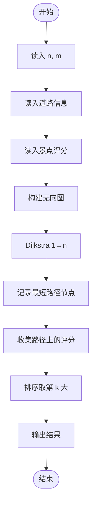
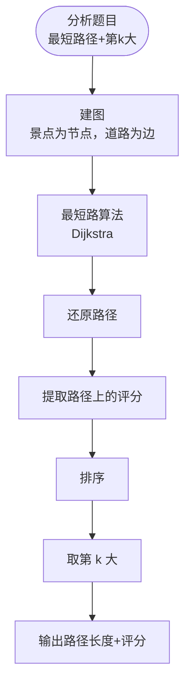

# L3-028 - 森森旅游（30 分）

- **时间限制**: 1000 ms
- **内存限制**: 131072 KB
- **代码长度限制**: 16 KB

---

## 题目描述

好久没出去旅游啦！森森决定去 Z 省旅游一下。

Z 省有 $$n$$ 座城市（从 $$1$$ 到 $$n$$ 编号）以及 $$m$$ 条连接两座城市的有向旅行线路（例如自驾、长途汽车、火车、飞机、轮船等），每次经过一条旅行线路时都需要支付该线路的费用（但这个收费标准可能不止一种，例如车票跟机票一般不是一个价格）。

Z 省为了鼓励大家在省内多逛逛，推出了**旅游金计划**：在 $$i$$ 号城市可以用 $$1$$ 元现金兑换 $$a_i$$ 元旅游金（只要现金足够，可以无限次兑换）。城市间的交通即可以使用现金支付路费，也可以用旅游金支付。具体来说，当通过第 $$j$$ 条旅行线路时，可以用 $$c_j$$ 元现金**或** $$d_j$$ 元旅游金支付路费。**注意：** 每次只能选择一种支付方式，不可同时使用现金和旅游金混合支付。但对于不同的线路，旅客可以自由选择不同的支付方式。

森森决定从 $$1$$ 号城市出发，到 $$n$$ 号城市去。他打算在出发前准备一些现金，并在途中的某个城市将剩余现金 **全部** 换成旅游金后继续旅游，直到到达 $$n$$ 号城市为止。当然，他也可以选择在 $$1$$ 号城市就兑换旅游金，或全部使用现金完成旅程。

Z 省政府会根据每个城市参与活动的情况调整汇率（即调整在某个城市 $$1$$ 元现金能换多少旅游金）。现在你需要帮助森森计算一下，在每次调整之后最少需要携带多少现金才能完成他的旅程。

### 输入格式:

输入在第一行给出三个整数 $$n$$，$$m$$ 与 $$q$$（$$1 \le n \le 10^5$$，$$1 \le m \le 2 \times 10^5$$，$$1 \le q \le 10^5$$），依次表示城市的数量、旅行线路的数量以及汇率调整的次数。

接下来 $$m$$ 行，每行给出四个整数 $$u$$，$$v$$，$$c$$ 与 $$d$$（$$1 \le u, v \le n$$，$$1 \le c, d \le 10^9$$），表示一条从 $$u$$ 号城市通向 $$v$$ 号城市的有向旅行线路。每次通过该线路需要支付 $$c$$ 元现金或 $$d$$ 元旅游金。数字间以空格分隔。输入保证从 $$1$$ 号城市出发，一定可以通过若干条线路到达 $$n$$ 号城市，但两城市间的旅行线路可能不止一条，对应不同的收费标准；也允许在城市内部游玩（即 $$u$$ 和 $$v$$ 相同）。

接下来的一行输入 $$n$$ 个整数 $$a_1, a_2, \cdots, a_n$$（$$1 \le a_i \le 10^9$$），其中 $$a_i$$ 表示一开始在 $$i$$ 号城市能用 $$1$$ 元现金兑换 $$a_i$$ 个旅游金。数字间以空格分隔。

接下来 $$q$$ 行描述汇率的调整。第 $$i$$ 行输入两个整数 $$x_i$$ 与 $$a'_i$$（$$1 \le x_i \le n$$，$$1 \le a'_i \le 10^9$$），表示第 $$i$$ 次汇率调整后，$$x_i$$ 号城市能用 $$1$$ 元现金兑换 $$a'_i$$ 个旅游金，而其它城市旅游金汇率不变。**请注意：**每次汇率调整都是在上一次汇率调整的基础上进行的。

### 输出格式:

对每一次汇率调整，在对应的一行中输出调整后森森至少需要准备多少现金，才能按他的计划从 $$1$$ 号城市旅行到 $$n$$ 号城市。

**再次提醒：**如果森森决定在途中的某个城市兑换旅游金，那么他必须将剩余现金**全部、一次性**兑换，剩下的旅途将完全使用旅游金支付。

### 输入样例:

```in
6 11 3
1 2 3 5
1 3 8 4
2 4 4 6
3 1 8 6
1 3 10 8
2 3 2 8
3 4 5 3
3 5 10 7
3 3 2 3
4 6 10 12
5 6 10 6
3 4 5 2 5 100
1 2
2 1
1 17
```

### 输出样例:

```out
8
8
1
```

## 样例解释:

对于第一次汇率调整，森森可以沿着 $$1 \to 2 \to 4 \to 6$$ 的线路旅行，并在 $$2$$ 号城市兑换旅游金；

对于第二次汇率调整，森森可以沿着 $$1 \to 2 \to 3 \to 4 \to 6$$ 的线路旅行，并在 $$3$$ 号城市兑换旅游金；

对于第三次汇率调整，森森可以沿着 $$1 \to 3 \to 5 \to 6$$ 的线路旅行，并在 $$1$$ 号城市兑换旅游金。

## 示例

### 示例 1

**输入:**
```
6 11 3
1 2 3 5
1 3 8 4
2 4 4 6
3 1 8 6
1 3 10 8
2 3 2 8
3 4 5 3
3 5 10 7
3 3 2 3
4 6 10 12
5 6 10 6
3 4 5 2 5 100
1 2
2 1
1 17
```

**输出:**
```
8
8
1
```

---

## 题目详解

### 一、解题思路

分别在现金费用图和反向旅游金费用图上求最短路。若在城市 i 兑换，所需现金为出发到 i 的现金费用加上后续旅游金费用除以汇率的向上取整；每次更新只需重算被修改城市的候选值并维护全局最小值。

### 二、代码流程说明

1. 建立现金正向图和旅游金反向图并分别 Dijkstra。
2. 对每个可能兑换城市计算现金需求。
3. 更新汇率后刷新该城市候选值，输出所有候选中的最小值。

### 三、代码实现

```r
# 实现原理：将输入组织为矩阵或表格，按题目定义的行、列和状态关系完成计算。
# 处理流程：读取输入 -> 建立状态 -> 执行算法 -> 按题目格式输出。
# 关键变量和循环均直接对应题目中的数据、约束或操作。

# 读取并解析标准输入。
v <- scan("stdin", what = numeric(), quiet = TRUE)
if (length(v) > 0L) {
    n <- as.integer(v[1])
    m <- as.integer(v[2])
    q <- as.integer(v[3])
    p <- 4L
    gc <- vector("list", n)
    gd <- vector("list", n)
# 按题目约束遍历当前数据，更新中间状态。
    for (i in seq_len(n)) {
        gc[[i]] <- list()
        gd[[i]] <- list()
    }
    for (i in seq_len(m)) {
        u <- as.integer(v[p])
        w <- as.integer(v[p + 1L])
        cst <- v[p + 2L]
        dst <- v[p + 3L]
        p <- p + 4L
        gc[[u]][[length(gc[[u]]) + 1L]] <- c(w, cst)
        gd[[w]][[length(gd[[w]]) + 1L]] <- c(u, dst)
    }
    rate <- v[seq.int(p, p + n - 1L)]
    p <- p + n
    dijkstra <- function(g, source) {
        inf <- 1e+30
        d <- rep(inf, n)
        d[source] <- 0
        pq <- matrix(c(0, source), nrow = 1L)
        while (nrow(pq) > 0L) {
# 执行核心排序、状态转移或选择逻辑。
            z <- order(pq[, 1])[1L]
            cur <- pq[z, ]
            if (nrow(pq) == 1L)
                pq <- matrix(numeric(0), nrow = 0L, ncol = 2L)
            else pq <- pq[-z, , drop = FALSE]
            du <- cur[1]
            u <- as.integer(cur[2])
            if (du != d[u])
                next
            for (e in g[[u]]) {
                w <- as.integer(e[1])
                nd <- du + e[2]
                if (nd < d[w]) {
                  d[w] <- nd
                  pq <- rbind(pq, c(nd, w))
                }
            }
        }
        d
    }
    dc <- dijkstra(gc, 1L)
    dd <- dijkstra(gd, n)
    inf <- 1e+30
    value <- function(i) if (dc[i] >= inf || dd[i] >= inf)
        inf
    else dc[i] + ceiling(dd[i]/rate[i])
    cur <- vapply(seq_len(n), value, numeric(1))
    out <- numeric(q)
    for (i in seq_len(q)) {
        x <- as.integer(v[p])
        rate[x] <- v[p + 1L]
        p <- p + 2L
        cur[x] <- value(x)
        out[i] <- min(cur)
    }
# 严格按照题目规定的输出格式输出答案。
    cat(paste(format(out, scientific = FALSE, trim = TRUE), collapse = "\n"),
        "\n", sep = "")
}
```

### 四、代码流程图



### 五、解题流程图



### 六、常见易错点

- 题目描述、输入格式、输出格式和输入输出样例必须保持原文不变。
- R 语言下标从 1 开始，注意编号转换和空输入边界。
- 输出时严格保留题目规定的空格、换行和小数位数。
