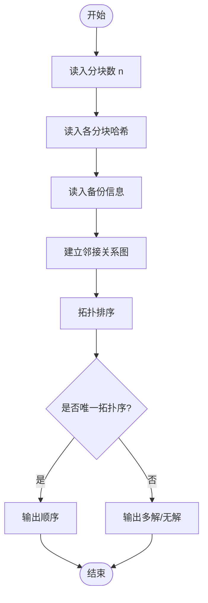
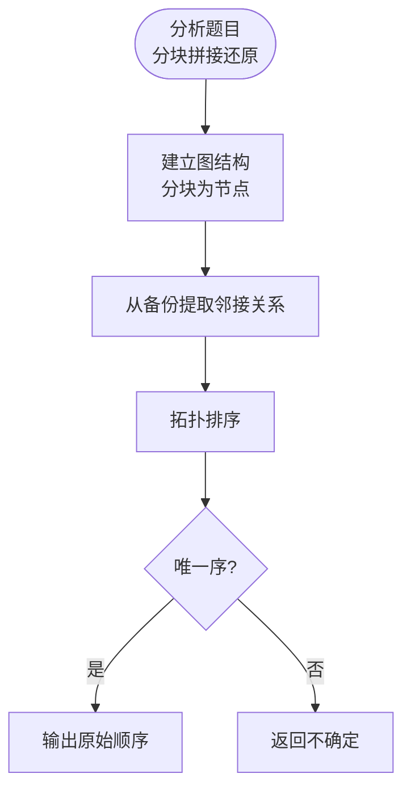

# L3-029 - 还原文件（30 分）

- **时间限制**: 200 ms
- **内存限制**: 65536 KB
- **代码长度限制**: 16 KB

---

## 题目描述

一份重要文件被撕成两半，其中一半还被送进了碎纸机。我们将碎纸机里找到的纸条进行编号，如图 1 所示。然后根据断口的折线形状跟没有切碎的半张纸进行匹配，最后还原成图 2 的样子。要求你输出还原后纸条的正确拼接顺序。


图1 纸条编号


图2 还原结果

### 输入格式:

输入首先在第一行中给出一个正整数 $$N$$（$$1 < N \le 10^5$$），为没有切碎的半张纸上断口折线角点的个数；随后一行给出从左到右 $$N$$ 个折线角点的高度值（均为不超过 100 的非负整数）。

随后一行给出一个正整数 $$M$$（$$\le 100$$），为碎纸机里的纸条数量。接下去有 $$M$$ 行，其中第 $$i$$ 行给出编号为 $$i$$（$$1\le i \le M$$）的纸条的断口信息，格式为：

```
K h[1] h[2] ... h[K]
```

其中 `K` 是断口折线角点的个数（不超过 $$10^4 +1$$），后面是从左到右 `K` 个折线角点的高度值。为简单起见，这个“高度”跟没有切碎的半张纸上断口折线角点的高度是一致的。

### 输出格式:

在一行中输出还原后纸条的正确拼接顺序。纸条编号间以一个空格分隔，行首尾不得有多余空格。

题目数据保证存在唯一解。

### 输入样例:

```in
17
95 70 80 97 97 68 58 58 80 72 88 81 81 68 68 60 80
6
4 68 58 58 80
3 81 68 68
3 95 70 80
3 68 60 80
5 80 72 88 81 81
4 80 97 97 68
```

### 输出样例:

```out
3 6 1 5 2 4
```

## 示例

### 示例 1

**输入:**
```
17
95 70 80 97 97 68 58 58 80 72 88 81 81 68 68 60 80
6
4 68 58 58 80
3 81 68 68
3 95 70 80
3 68 60 80
5 80 72 88 81 81
4 80 97 97 68
```

**输出:**
```
3 6 1 5 2 4
```

---

## 题目详解

### 一、解题思路

碎纸条必须按顺序覆盖完整高度序列，相邻纸条共享一个断口端点。用 DFS 枚举尚未使用的纸条，只有其高度序列与当前位置匹配时才递归；题目保证唯一解。

### 二、代码流程说明

1. 读入完整断口序列和每张纸条的高度序列。
2. 从位置 0 开始尝试每张未使用且匹配的纸条，按重叠端点推进位置。
3. 用完所有纸条且恰好覆盖完整序列后输出编号顺序。

### 三、代码实现

```r
# 实现原理：读取标准输入后建立题目所需的数据结构，按约束执行核心计算并输出结果。
# 处理流程：读取输入 -> 建立状态 -> 执行算法 -> 按题目格式输出。
# 关键变量和循环均直接对应题目中的数据、约束或操作。

# 读取并解析标准输入。
v <- scan("stdin", what = integer(), quiet = TRUE)
if (length(v) > 0L) {
    p <- 1L
    n <- v[p]
    p <- p + 1L
    h <- v[seq.int(p, p + n - 1L)]
    p <- p + n
    m <- v[p]
    p <- p + 1L
    strips <- vector("list", m)
# 按题目约束遍历当前数据，更新中间状态。
    for (i in seq_len(m)) {
        k <- v[p]
        p <- p + 1L
        strips[[i]] <- v[seq.int(p, p + k - 1L)]
        p <- p + k
    }
    used <- rep(FALSE, m)
    answer <- NULL
    dfs <- function(pos, depth, path) {
        if (!is.null(answer))
            return(invisible(NULL))
        if (depth == m) {
            if (pos == n)
                answer <<- path
            return(invisible(NULL))
        }
        for (i in seq_len(m)) {
            z <- strips[[i]]
            len <- length(z)
            if (used[i] || pos + len > n || !identical(h[seq.int(pos +
                1L, pos + len)], z))
                next
            nxt <- if (depth + 1L == m)
                pos + len
            else pos + len - 1L
            if (depth + 1L < m && nxt >= n)
                next
            used[i] <<- TRUE
            dfs(nxt, depth + 1L, c(path, i))
            used[i] <<- FALSE
        }
    }
    dfs(0L, 0L, integer())
    if (!is.null(answer))
# 严格按照题目规定的输出格式输出答案。
        cat(paste(answer, collapse = " "), "\n", sep = "")
}
```

### 四、代码流程图



### 五、解题流程图



### 六、常见易错点

- 题目描述、输入格式、输出格式和输入输出样例必须保持原文不变。
- R 语言下标从 1 开始，注意编号转换和空输入边界。
- 输出时严格保留题目规定的空格、换行和小数位数。
