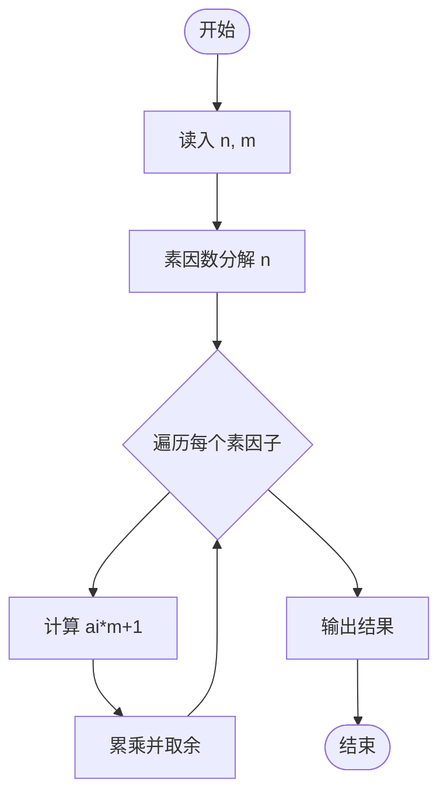
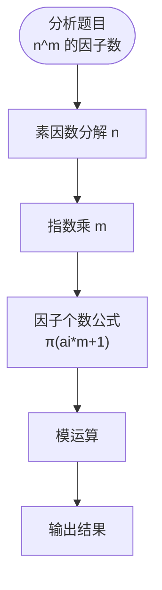

# L3-030 - 可怜的简单题（30 分）

- **时间限制**: 10000 ms
- **内存限制**: 524288 KB
- **代码长度限制**: 16 KB

---

## 题目描述

九条可怜去年出了一道题，导致一众参赛高手惨遭团灭。今年她出了一道简单题 —— 打算按照如下的方式生成一个随机的整数数列 $$A$$:

1. 最开始，数列 $$A$$ 为空。

2. 可怜会从区间 $$[1,n]$$ 中等概率随机一个整数 $$i$$ 加入到数列 $$A$$ 中。

3. 如果不存在一个大于 $$1$$ 的正整数 $$w$$，满足 $$A$$ 中所有元素都是 $$w$$ 的倍数，数组 $$A$$ 将会作为随机生成的结果返回。否则，可怜将会返回第二步，继续增加 $$A$$ 的长度。

现在，可怜告诉了你数列 $$n$$ 的值，她希望你计算返回的数列 $$A$$ 的期望长度。

### 输入格式:

输入一行两个整数 $$n, p$$ $$(1 \le n \le 10^{11}, n < p \le 10^{12})$$，$$p$$ 是一个质数。

### 输出格式:

在一行中输出一个整数，表示答案对 $$p$$ 取模的值。具体来说，假设答案的最简分数表示为 $$\frac{x}{y}$$，你需要输出最小的非负整数 $$z$$ 满足 $$y \times z \equiv x \text{ mod } p$$。

### 输入样例 1:

```in
2 998244353
```

### 输出样例 1:

```out
2
```

### 输入样例 2:

```in
100000000 998244353
```

### 输出样例 2:

```out
3056898
```

## 示例

### 示例 1

**输入:**
```
2 998244353
```

**输出:**
```
2
```

### 示例 2

**输入:**
```
100000000 998244353
```

**输出:**
```
3056898
```

---

## 题目详解

### 一、解题思路

本题的 R 实现采用以下方法：把原问题拆成规模更小的子问题，用状态转移保存已计算结果，避免重复计算。

### 二、代码流程说明

1. 读取并解析标准输入，转换为题目所需的数据结构。
2. 按题意执行核心算法，维护中间状态并处理边界情况。
3. 整理计算结果，按照输出格式生成答案。

### 三、代码实现

```r
# 实现原理：把原问题拆成规模更小的子问题，用状态转移保存已计算结果，避免重复计算。
# 处理流程：读取输入 -> 建立状态 -> 执行算法 -> 按题目格式输出。
# 关键变量和循环均直接对应题目中的数据、约束或操作。

# 读取并解析标准输入。
v <- scan("stdin", what = numeric(), quiet = TRUE)
if (length(v) > 0L) {
    n <- v[1]
    mod <- v[2]
    if (n == 1) {
# 严格按照题目规定的输出格式输出答案。
        cat(1%%mod, "\n", sep = "")
    }
    else {
        lim <- min(n, 1e+06)
        mu <- integer(lim)
        comp <- logical(lim)
        primes <- integer()
        mu[1] <- 1L
        if (lim >= 2)
# 按题目约束遍历当前数据，更新中间状态。
            for (i in 2:lim) {
                if (!comp[i]) {
                  primes <- c(primes, i)
                  mu[i] <- -1L
                }
                for (pr in primes) {
                  z <- i * pr
                  if (z > lim)
                    break
                  comp[z] <- TRUE
                  if (i%%pr == 0) {
                    mu[z] <- 0L
                    break
                  }
                  else mu[z] <- -mu[i]
                }
            }
        pref <- c(0, cumsum(mu))
        memo <- new.env(hash = TRUE, parent = emptyenv())
        mertens <- function(x) {
            x <- as.numeric(x)
            if (x <= lim)
                return(pref[as.integer(x) + 1L])
            key <- as.character(x)
            if (exists(key, envir = memo, inherits = FALSE))
                return(get(key, envir = memo, inherits = FALSE))
            ans <- 1
            l <- 2
            while (l <= x) {
                quo <- floor(x/l)
                r <- floor(x/quo)
                ans <- ans - (r - l + 1) * mertens(quo)
                l <- r + 1
            }
            assign(key, ans, envir = memo)
            ans
        }
        B <- 1000
        mm <- function(a, b) {
            da <- floor(a/B^(0:3))%%B
            db <- floor(b/B^(0:3))%%B
            co <- numeric(7)
            for (i in 0:3) for (j in 0:3) co[i + j + 1L] <- co[i +
                j + 1L] + da[i + 1L] * db[j + 1L]
            z <- 0
            for (i in 7:1) z <- (z * B + co[i])%%mod
            z
        }
        mpow <- function(a, e) {
            z <- 1
            a <- a%%mod
            while (e > 0) {
                if (e%%2 == 1)
                  z <- mm(z, a)
                a <- mm(a, a)
                e <- floor(e/2)
            }
            z
        }
        total <- 0
        l <- 2
        while (l <= n) {
            quo <- floor(n/l)
            r <- floor(n/quo)
            sm <- mertens(r) - mertens(l - 1)
            if (sm != 0)
                total <- (total + mm(mm(sm%%mod, quo%%mod), mpow((n -
                  quo)%%mod, mod - 2)))%%mod
            l <- r + 1
        }
        cat((1 - total)%%mod, "\n", sep = "")
    }
}
```

### 四、代码流程图



### 五、解题流程图



### 六、常见易错点

- 题目描述、输入格式、输出格式和输入输出样例必须保持原文不变。
- R 语言下标从 1 开始，注意编号转换和空输入边界。
- 输出时严格保留题目规定的空格、换行和小数位数。
