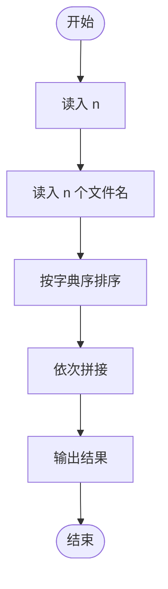
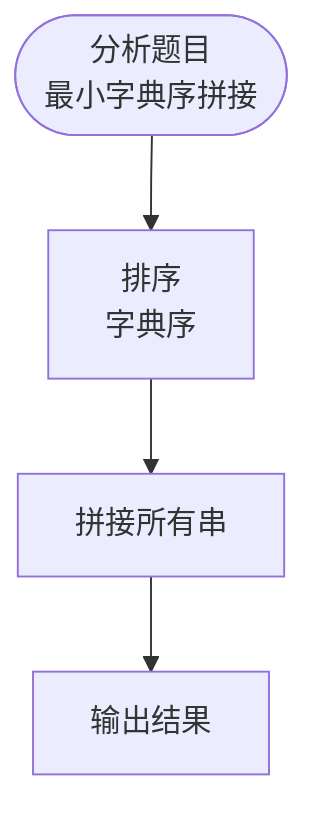

# L3-031 - 千手观音（30 分）

- **时间限制**: 200 ms
- **内存限制**: 65536 KB
- **代码长度限制**: 16 KB

---

## 题目描述


人类喜欢用 10 进制，大概是因为人类有一双手 10 根手指用于计数。于是在千手观音的世界里，数字都是 10 000 进制的，因为每位观音有 1 000 双手 ……

千手观音们的每一根手指都对应一个符号（但是观音世界里的符号太难画了，我们暂且用小写英文字母串来代表），就好像人类用自己的 10 根手指对应 0 到 9 这 10 个数字。同样的，就像人类把这 10 个数字排列起来表示更大的数字一样，ta们也把这些名字排列起来表示更大的数字，并且也遵循左边高位右边低位的规则，相邻名字间用一个点 `.` 分隔，例如 `pat.pta.cn` 表示千手观音世界里的一个 3 位数。

人类不知道这些符号代表的数字的大小。不过幸运的是，人类发现了千手观音们留下的一串数字，并且有理由相信，这串数字是从小到大有序的！于是你的任务来了：请你根据这串有序的数字，推导出千手观音每只手代表的符号的相对顺序。

注意：有可能无法根据这串数字得到全部的顺序，你只要尽量推出能得到的结果就好了。当若干根手指之间的相对顺序无法确定时，就暂且按它们的英文字典序升序排列。例如给定下面几个数字：

```
pat
cn
lao.cn
lao.oms
pta.lao
pta.pat
cn.pat
```

我们首先可以根据前两个数字推断 `pat` < `cn`；根据左边高位的顺序可以推断 `lao` < `pta` < `cn`；再根据高位相等时低位的顺序，可以推断出 `cn` < `oms`，`lao` < `pat`。综上我们得到两种可能的顺序：`lao` < `pat` < `pta` < `cn` < `oms`；或者 `lao` < `pta` < `pat` < `cn` < `oms`，即 `pat` 和 `pta` 之间的相对顺序无法确定，这时我们按字典序排列，得到 `lao` < `pat` < `pta` < `cn` < `oms`。

### 输入格式:

输入第一行给出一个正整数 $$N$$ ($$\le 10^5$$)，为千手观音留下的数字的个数。随后 $$N$$ 行，每行给出一个千手观音留下的数字，不超过 10 位数，每一位的符号用不超过 3 个小写英文字母表示，相邻两符号之间用 `.` 分隔。

我们假设给出的数字顺序在千手观音的世界里是严格递增的。题目保证数字是 $$10^4$$ 进制的，即符号的种类肯定不超过 $$10^4$$ 种。

### 输出格式:

在一行中按大小递增序输出符号。当若干根手指之间的相对顺序无法确定时，按它们的英文字典序升序排列。符号间仍然用 `.` 分隔。

### 输入样例:

```in
7
pat
cn
lao.cn
lao.oms
pta.lao
pta.pat
cn.pat

```

### 输出样例:

```out
lao.pat.pta.cn.oms

```

## 示例

### 示例 1

**输入:**
```
7
pat
cn
lao.cn
lao.oms
pta.lao
pta.pat
cn.pat

```

**输出:**
```
lao.pat.pta.cn.oms

```

---

## 题目详解

### 一、解题思路

本题的 R 实现采用以下方法：比较相邻字符串找到首个不同单词，建立字典序约束图；用字典序最小的 Kahn 拓扑排序恢复单词顺序。

### 二、代码流程说明

1. 读取并解析标准输入，转换为题目所需的数据结构。
2. 按题意执行核心算法，维护中间状态并处理边界情况。
3. 整理计算结果，按照输出格式生成答案。

### 三、代码实现

```r
# 实现原理：比较相邻字符串找到首个不同单词，建立字典序约束图；用字典序最小的 Kahn 拓扑排序恢复单词顺序。
# 处理流程：读取输入 -> 建立状态 -> 执行算法 -> 按题目格式输出。
# 关键变量和循环均直接对应题目中的数据、约束或操作。

# 读取并解析标准输入。
lines <- trimws(readLines("stdin", warn = FALSE))
lines <- lines[nzchar(lines)]
if (length(lines) > 0L) {
    n <- as.integer(lines[1])
    words_by_line <- lapply(lines[seq.int(2L, n + 1L)], function(x) strsplit(x,
        ".", fixed = TRUE)[[1]])
# 执行核心排序、状态转移或选择逻辑。
    words <- sort(unique(unlist(words_by_line)))
    id <- setNames(seq_along(words), words)
    g <- vector("list", length(words))
    deg <- integer(length(words))
# 按题目约束遍历当前数据，更新中间状态。
    for (i in seq_along(g)) g[[i]] <- integer()
    if (n > 1L)
        for (i in seq_len(n - 1L)) {
            a <- words_by_line[[i]]
            b <- words_by_line[[i + 1L]]
            if (length(a) == length(b))
                for (j in seq_along(a)) if (a[j] != b[j]) {
                  u <- id[[a[j]]]
                  w <- id[[b[j]]]
                  if (!(w %in% g[[u]])) {
                    g[[u]] <- c(g[[u]], w)
                    deg[w] <- deg[w] + 1L
                  }
                  break
                }
        }
    queue <- which(deg == 0L)
    ans <- character()
    while (length(queue)) {
        u <- queue[order(words[queue])[1L]]
        queue <- queue[queue != u]
        ans <- c(ans, words[u])
        for (w in g[[u]]) {
            deg[w] <- deg[w] - 1L
            if (deg[w] == 0L)
                queue <- c(queue, w)
        }
    }
# 严格按照题目规定的输出格式输出答案。
    cat(paste(ans, collapse = "."), "\n", sep = "")
}
```

### 四、代码流程图



### 五、解题流程图



### 六、常见易错点

- 题目描述、输入格式、输出格式和输入输出样例必须保持原文不变。
- R 语言下标从 1 开始，注意编号转换和空输入边界。
- 输出时严格保留题目规定的空格、换行和小数位数。
