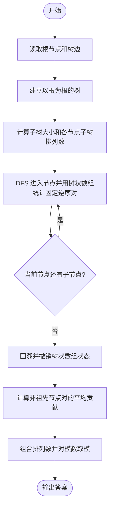
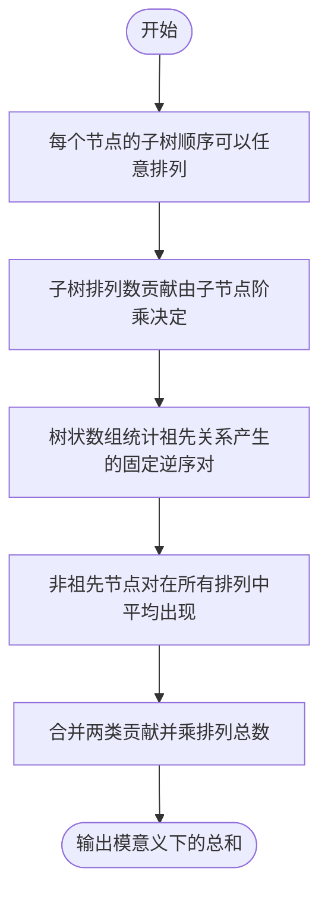

# L3-032 - 关于深度优先搜索和逆序对的题应该不会很难吧这件事（30 分）

- **时间限制**: 1000 ms
- **内存限制**: 262144 KB
- **代码长度限制**: 16 KB

---

## 背景知识

### 深度优先搜索与 DFS 序

深度优先搜索算法（DFS）是一种用于遍历或搜索树或图的算法。以下伪代码描述了在树 $T$ 上进行深度优先搜索的过程：

```
procedure DFS(T, u, L)      // T 是被深度优先搜索的树
                            // u 是当前搜索的节点
                            // L 是一个链表，保存了所有节点被第一次访问的顺序
  append u to L             // 将节点 u 添加到链表 L 的末尾
  for v in u.children do    // 枚举节点 u 的所有子节点 v
    DFS(T, v)               // 递归搜索节点 v
```

令 $r$ 为树 $T$ 的根，调用 `DFS(T, r, L)` 即可完成对 $T$ 的深度优先搜索，保存在链表 $L$ 中的排列被称为 DFS 序。相信聪明的你已经发现了，如果枚举子节点的顺序不同，最终得到的 DFS 序也会不同。

### 逆序对

给定一个长度为 $n$ 的整数序列 $a_1, a_2, \cdots, a_n$，该序列的逆序对数量是同时满足以下条件的有序数对 $(i, j)$ 的数量：
* $1 \le i < j \le n$；
* $a_i > a_j$。

## 问题求解

给定一棵 $n$ 个节点的树，其中节点 $r$ 为根。求该树所有可能的 DFS 序中逆序对数量之和。

### 输入格式:

第一行输入两个整数 $n$，$r$（$2 \le n \le 3 \times 10^5$，$1 \le r \le n$）表示树的大小与根节点。

对于接下来的 $(n - 1)$ 行，第 $i$ 行输入两个整数 $u_i$ 与 $v_i$（$1 \le u_i, v_i \le n$），表示树上有一条边连接节点 $u_i$ 与 $v_i$。

### 输出格式:

输出一行一个整数，表示该树所有可能的 DFS 序中逆序对数量之和。由于答案可能很大，请对 $10^9 + 7$ 取模后输出。

### 输入样例 1:

```in
5 3
1 5
2 5
3 5
4 3
```

### 输出样例 1:

```out
24
```

### 输入样例 2:

```in
10 5
10 2
2 5
10 7
7 1
7 9
4 2
3 10
10 8
3 6
```

### 输出样例 2:

```out
516
```

## 示例

### 示例 1

**输入:**
```
5 3
1 5
2 5
3 5
4 3
```

**输出:**
```
24
```

### 示例 2

**输入:**
```
10 5
10 2
2 5
10 7
7 1
7 9
4 2
3 10
10 8
3 6
```

**输出:**
```
516
```

## 样例解释

下图展示了样例 1 中的树。


该树共有 $4$ 种可能的 DFS 序：
* $\{3, 4, 5, 1, 2\}$，有 6 个逆序对；
* $\{3, 4, 5, 2, 1\}$，有 7 个逆序对；
* $\{3, 5, 1, 2, 4\}$，有 5 个逆序对；
* $\{3, 5, 2, 1, 4\}$，有 6 个逆序对。

因此答案为 $6 + 7 + 5 + 6 = 24$。

---

## 题目详解

### 一、解题思路

本题的 R 实现采用以下方法：读取标准输入后建立题目所需的数据结构，按约束执行核心计算并输出结果。

### 二、代码流程说明

1. 读取并解析标准输入，转换为题目所需的数据结构。
2. 按题意执行核心算法，维护中间状态并处理边界情况。
3. 整理计算结果，按照输出格式生成答案。

### 三、代码实现

```r
# 实现原理：读取标准输入后建立题目所需的数据结构，按约束执行核心计算并输出结果。
# 处理流程：读取输入 -> 建立状态 -> 执行算法 -> 按题目格式输出。
# 关键变量和循环均直接对应题目中的数据、约束或操作。

# 读取并解析标准输入。
v <- scan("stdin", what = integer(), quiet = TRUE)
if (length(v) > 0L) {
    mod <- 1000000007
    n <- v[1]
    root <- v[2]
    p <- 3L
    g <- vector("list", n)
# 按题目约束遍历当前数据，更新中间状态。
    for (i in seq_len(n)) g[[i]] <- integer()
    for (i in seq_len(n - 1L)) {
        a <- v[p]
        b <- v[p + 1L]
        p <- p + 2L
        g[[a]] <- c(g[[a]], b)
        g[[b]] <- c(g[[b]], a)
    }
    par <- integer(n)
    child <- vector("list", n)
    for (i in seq_len(n)) child[[i]] <- integer()
    order <- root
    h <- 1L
    par[root] <- -1L
    while (h <= length(order)) {
        u <- order[h]
        h <- h + 1L
        for (w in g[[u]]) if (w != par[u]) {
            par[w] <- u
            child[[u]] <- c(child[[u]], w)
            order <- c(order, w)
        }
    }
    sz <- rep(1, n)
    for (u in rev(order)) if (par[u] > 0L)
        sz[par[u]] <- sz[par[u]] + sz[u]
    fact <- cumprod(c(1, seq_len(n)))%%mod
    ways <- 1
    for (u in seq_len(n)) ways <- ways * fact[length(child[[u]]) +
        1L]%%mod
    bitv <- integer(n + 1L)
    add <- function(i) {
        while (i <= n) {
            bitv <<- replace(bitv, i, bitv[i] + 1L)
            i <- i + bitwAnd(i, -i)
        }
    }
    sumbit <- function(i) {
        z <- 0L
        while (i > 0L) {
            z <- z + bitv[i]
            i <- i - bitwAnd(i, -i)
        }
        z
    }
    fixed <- 0
    stack <- list(c(root, 0L, 0L))
    while (length(stack)) {
        cur <- stack[[length(stack)]]
        stack <- stack[-length(stack)]
        u <- cur[1]
        state <- cur[2]
        anc <- cur[3]
        if (state == 0L) {
            fixed <- fixed + anc - sumbit(u)
            add(u)
            stack[[length(stack) + 1L]] <- c(u, 1L, anc + 1L)
            for (w in rev(child[[u]])) stack[[length(stack) +
                1L]] <- c(w, 0L, anc + 1L)
        }
        else {
            i <- u
            while (i <= n) {
                bitv <<- replace(bitv, i, bitv[i] - 1L)
                i <- i + bitwAnd(i, -i)
            }
        }
    }
    anc <- sum(sz - 1)
    inc <- n * (n - 1)/2 - anc
    inv2 <- 500000004
# 严格按照题目规定的输出格式输出答案。
    cat((ways * ((fixed + inc * inv2)%%mod))%%mod, "\n", sep = "")
}
```

### 四、代码流程图



### 五、解题流程图



### 六、常见易错点

- 题目描述、输入格式、输出格式和输入输出样例必须保持原文不变。
- R 语言下标从 1 开始，注意编号转换和空输入边界。
- 输出时严格保留题目规定的空格、换行和小数位数。
