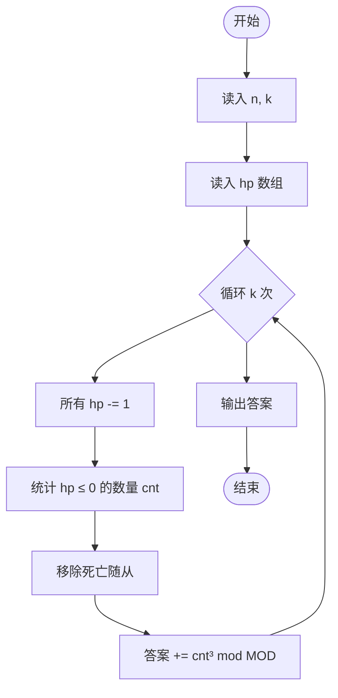
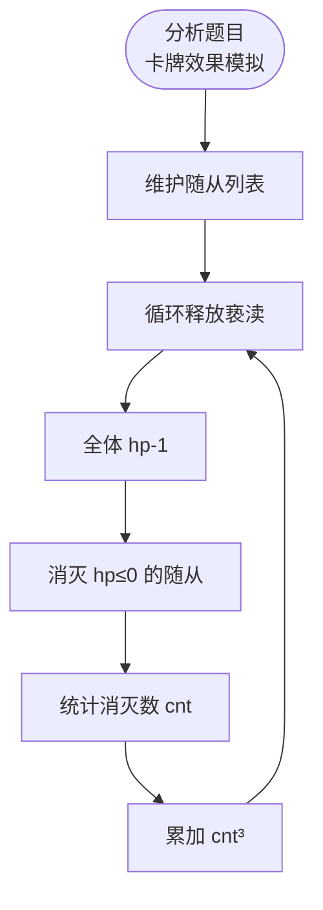

# L3-033 - 教科书般的亵渎（30 分）

- **时间限制**: 2000 ms
- **内存限制**: 262144 KB
- **代码长度限制**: 16 KB

---

## 题目描述

九条可怜最近在玩一款卡牌游戏。在每一局游戏中，可怜都要使用抽到的卡牌来消灭一些敌人。每一名敌人都有一个初始血量，而当血量降低到 $$0$$ 及以下的时候，这名敌人就会立即被消灭并从场上消失。

现在，可怜面前有 $$n$$ 个敌人，其中第 $$i$$ 名敌人的血量是 $$a_i$$，而可怜手上只有如下两张手牌：

1. 如果场上还有敌人，等概率随机选中一个敌人并对它造成一点伤害（即血量减 $$1$$），重复 $$K$$ 次。

2. 对所有敌人造成一点伤害，重复该效果直到没有新的敌人被消灭。

下面是这两张手牌效果的一些示例：

1. 假设存在两名敌人，他们的血量分别是 $$1, 2$$ 且 $$K = 2$$。那么在可怜打出第一张手牌后，可能会发生如下情况：

- 第一轮中，两名敌人各有 $$0.5$$ 的概率被选中。假设第一名敌人被选中，那么它会被造成一点伤害。这时它的血量变成了 $$0$$，因此它被消灭并消失了。
- 第二轮中，因为场上只剩下了第二名敌人，所以它一定会被选中并被造成一点伤害。这时它剩下的血量为 $$1$$。

2. 同样假设存在两名敌人且血量分别为 $$1, 2$$。那么在可怜打出第二张手牌后，会发生如下情况：

- 第一轮中，所有敌人被造成了一点伤害。这时第一名敌人被消灭了，因此卡牌效果会被重复一遍。
- 第二轮中，所有敌人（此时只剩下第二名敌人了）被造成了一点伤害。这时第二名敌人也被消灭了，因此卡牌效果会被再重复一遍。
- 第三轮中，所有敌人（此时没有敌人剩下了）被造成了一点伤害。因为没有新的敌人被消灭了，所以卡牌效果结束。

3. 如果面对的是四名血量分别为 $$1,2,2,4$$ 的敌人，那么在可怜打出第二张手牌后，只有第四名敌人还会存活，且它的剩余血量为 $$1$$。

现在，可怜先打出了第一张手牌，再打出了第二张手牌。她发现，在第一张手牌效果结束后，没有任何一名敌人被消灭，但是在第二张手牌的效果结束后，所有敌人都被消灭了。

可怜想让你计算一下这种情况发生的概率是多少。

### 输入格式:

第一行输入两个整数 $$n, K(1 \le n, K \le 50)$$，分别表示敌人的数量以及第一张卡牌效果的发动次数。

第二行输入 $$n$$ 个由空格隔开的整数 $$a_i (1 \le a_i \le 50)$$，表示每个敌人的初始血量。

### 输出格式:

在一行中输出一个整数，表示发生概率对 $$998244353$$ 取模后的结果。

具体来说，如果概率的最简分数表示为 $$a/b (a \ge 0, b \ge 1, \gcd(a,b) = 1)$$，那么你需要输出 

$$a \times b^{998244351} \mod 998244353$$。

### 输入样例 1:

```in
3 2
2 3 3

```

### 输出样例 1:

```out
665496236

```

## 样例解释 1：

在第一张手牌的效果结束后，三名敌人的剩余血量只可能在如下几种中：$$[1, 3, 2]$$, $$[1, 2, 3]$$, $$[2, 1, 3]$$ 和 $$[2, 3, 1]$$。前两种发生的概率是 $$2/9$$，后两种发生的概率是 $$1/9$$。因此答案为 $$2/3$$，输出 $$2 \times 3^{998244351} \mod 998244353 = 665496236$$。

### 输入样例 2:

```in
3 3
2 3 3

```

### 输出样例 2:

```out
776412275

```

## 样例解释 2:

在第一张手牌的效果结束后，三名敌人的剩余血量只可能在如下几种中：$$[1,2,2]$$、$$[2, 1, 2]$$ 和 $$ [2, 2, 1]$$。第一种发生的概率是 $$2/9$$，后两种发生的概率是 $$1/9$$。因此答案为 $$4/9$$，输出 $$4 \times 9^{998244351} \mod 998244353 = 776412275$$。

### 输入样例 3:

```in
5 3
1 4 4 2 5

```

### 输出样例 3:

```out
367353922

```

### 输入样例 4:

```in
12 12
1 2 3 4 5 6 7 8 9 10 11 12

```

### 输出样例 4:

```out
452061016

```

## 示例

### 示例 1

**输入:**
```
3 2
2 3 3

```

**输出:**
```
665496236

```

### 示例 2

**输入:**
```
3 3
2 3 3

```

**输出:**
```
776412275

```

### 示例 3

**输入:**
```
5 3
1 4 4 2 5

```

**输出:**
```
367353922

```

### 示例 4

**输入:**
```
12 12
1 2 3 4 5 6 7 8 9 10 11 12

```

**输出:**
```
452061016

```

---

## 题目详解

### 一、解题思路

本题的 R 实现采用以下方法：把原问题拆成规模更小的子问题，用状态转移保存已计算结果，避免重复计算。

### 二、代码流程说明

1. 读取并解析标准输入，转换为题目所需的数据结构。
2. 按题意执行核心算法，维护中间状态并处理边界情况。
3. 整理计算结果，按照输出格式生成答案。

### 三、代码实现

```r
# 实现原理：把原问题拆成规模更小的子问题，用状态转移保存已计算结果，避免重复计算。
# 处理流程：读取输入 -> 建立状态 -> 执行算法 -> 按题目格式输出。
# 关键变量和循环均直接对应题目中的数据、约束或操作。

# 读取并解析标准输入。
v <- scan("stdin", what = numeric(), quiet = TRUE)
if (length(v) > 0L) {
    mod <- 998244353
    B <- 32768
    mm <- function(a, b) {
        a0 <- a%%B
        a1 <- floor(a/B)
        b0 <- b%%B
        b1 <- floor(b/B)
        z <- (((a1 * b1)%%mod) * B + a1 * b0 + a0 * b1)%%mod
        (z * B + a0 * b0)%%mod
    }
    n <- as.integer(v[1])
    k <- as.integer(v[2])
    hp <- v[seq(3L, 2L + n)]
    mpow <- function(a, e) {
        r <- 1
        a <- a%%mod
# 按题目约束遍历当前数据，更新中间状态。
        while (e > 0) {
            if (e%%2 == 1)
                r <- mm(r, a)
            a <- mm(a, a)
            e <- floor(e/2)
        }
        r
    }
    f <- numeric(k + 1L)
    f[1] <- 1
    if (k > 0L)
        for (i in seq_len(k)) f[i + 1L] <- mm(f[i], i)
    invf <- numeric(k + 1L)
    invf[k + 1L] <- mpow(f[k + 1L], mod - 2)
    if (k > 0L)
        for (i in k:1) invf[i] <- mm(invf[i + 1L], i)
    zero_mask <- paste(rep("0", max(hp)), collapse = "")
# 执行核心排序、状态转移或选择逻辑。
    dp <- vector("list", k + 1L)
    for (i in seq_along(dp)) dp[[i]] <- numeric()
    dp[[1]][zero_mask] <- 1
    for (hval in hp) {
        nd <- vector("list", k + 1L)
        for (i in seq_along(nd)) nd[[i]] <- numeric()
        for (used in 0:k) if (length(dp[[used + 1L]]))
            for (mask in names(dp[[used + 1L]])) for (c in 0:min(hval -
                1, k - used)) {
                b <- hval - c
                bits <- strsplit(mask, "", fixed = TRUE)[[1]]
                bits[b] <- "1"
                nm <- paste(bits, collapse = "")
                z <- nd[[used + c + 1L]][nm]
                if (is.na(z))
                  z <- 0
                nd[[used + c + 1L]][nm] <- (z + mm(dp[[used +
                  1L]][mask], invf[c + 1L]))%%mod
            }
        dp <- nd
    }
    s <- 0
    if (length(dp[[k + 1L]]))
        for (mask in names(dp[[k + 1L]])) if (grepl("^1*0*$",
            mask))
            s <- (s + dp[[k + 1L]][mask])%%mod
    ans <- mm(mm(s, f[k + 1L]), mpow(mpow(n, k), mod - 2))
# 严格按照题目规定的输出格式输出答案。
    cat(ans, "\n", sep = "")
}
```

### 四、代码流程图



### 五、解题流程图



### 六、常见易错点

- 题目描述、输入格式、输出格式和输入输出样例必须保持原文不变。
- R 语言下标从 1 开始，注意编号转换和空输入边界。
- 输出时严格保留题目规定的空格、换行和小数位数。
