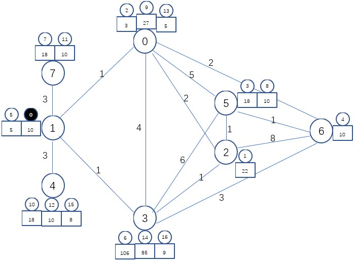
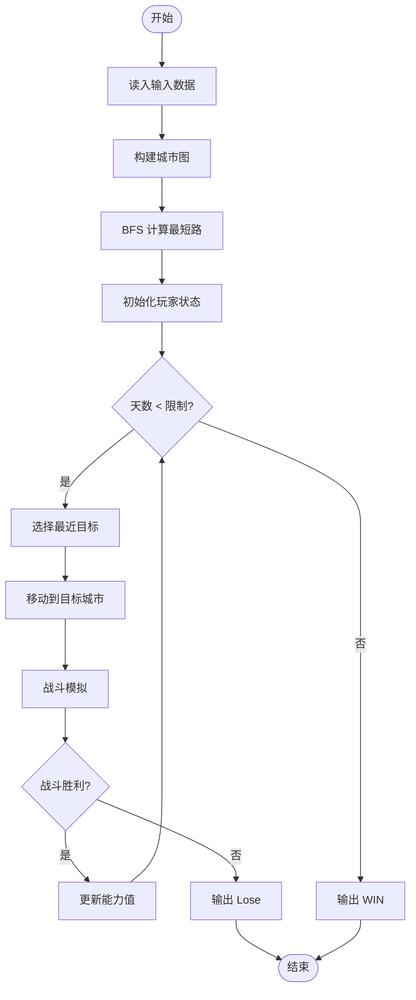
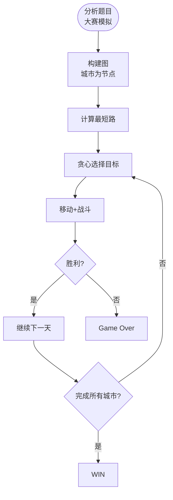

# L3-034 - 超能力者大赛（30 分）

- **时间限制**: 600 ms
- **内存限制**: 65536 KB
- **代码长度限制**: 16 KB

---

## 题目描述


知乎上有这样一个话题：“全世界范围内突然出现 666 个超能力者，击败对手就能获得对手的超能力，最终获胜者将如何自处？”

现在让我们来将这个超能力者大赛的规则具体化：给定 $N$ 位超能力者（超能力者从 0 到 $N-1$ 编号，你的编号为 0），分布在全世界 $M$ 座城市中（城市从 0 到 $M-1$ 编号），比赛从第 1 天开始，到第 $D$ 天结束。每位超能力者有一个能力值 $E_i$（$i=0, \cdots , N-1$）。

如果你的能力值**大于等于**对手的能力值，就可以将其击败，并且对方的能力值立刻直接累加到你的能力值上。但是，当你每次到达一座城市，击败一位对手后，就会惊动这座城市中所有剩下的超能力者（包括联盟）。这座城市中剩下的所有个体能力值**小于等于**你的超能力者就会立刻团结起来形成联盟，联盟的能力值等于所有联盟成员能力值的总和。联盟将从此作为一个整体进攻或防御你，你可将联盟等价地理解为一个超能力者，它还可能在后续的战斗中继续与其它弱小的同城选手或联盟合并。第二天，这个城市中任何能力值**大于**你的对手就会找上门来，而你为了自保，就只能赶紧离开这个城市……

此外，还有如下补充规定：

* 你每天只能进行 1 场战斗，击败一个超能力者（包括联盟），或者被一个能力值**大于**你的超能力者（包括联盟）击败。
* 比赛中间没有一天可以休息，你或者在战斗，或者在去往另一个城市的路上。
* 当你到达一个城市时，会在到达的第二天进行战斗。
* 当你结束战斗要离开这个城市时，是第二天开始出发。

下面我们为你设计一套贪心算法，就请你验证一下，这个算法能否让你得到这个大赛的冠军。算法步骤很简单：

* 第 1 步：从所有超能力者（包括联盟）中找出一个与自己能力值最接近、同时自己能够击败的对手，用最短时间去到对方的城市，在到达后第二天击败之；
* 第 2 步：如果该城市中没有能力值**大于**你的超能力者（包括联盟），按照规则逐一击败之；如果该城市中已经没有超能力者、或你第二天没有必胜把握，则回到第 1 步。

重复上述步骤，直到你：

* 击败了所有超能力者；或
* 你已经无路可逃（即剩下的所有超能力者的能力值都**大于**你）；或
* 比赛终止时间到。

第 1 步中有可能遇到多个符合条件的对手，并列情况下优先选最近的；距离也并列的情况下选途径城市最少的；再有并列就选城市编号最小的。

### 输入格式:

输入在第一行中给出 4 个正整数：$N$（$\le 10^5$），为参加比赛的超能力者人数；$M$（$\le 200$），为比赛涉及的城市数量；$M_e$ 为城市间直达通路的数量；$D$（$\le 1000$）为比赛时长（以“天”为单位）。\
随后 $N$ 行，第 $i$ 行（$i=0, \cdots , N-1$）给出第 $i$ 位参赛者的信息，格式为：

```
所在城市编号 能力值
```

其中`能力值`是不超过 1000 的正整数。\
接下来是城市通路信息，分 $M_e$ 行，每行给出一对城市间的双向直接通路信息，格式为：

```
城市1 城市2 通行时间
```

其中`通行时间`为不超过 $D/2$ 的正整数，以“天”为单位。题目保证每条道路的信息只出现一次，没有重复。

### 输出格式:

顺次输出你每一步的活动，每个活动占一行，格式为：

```
Get e at city on day d.
```

表示第 `d` 天在编号为 `city` 的城市击败了一个能力值为 `e` 的对手。

```
Move from city1 to city2.
```

表示从编号为 `city1` 的城市**到达**了编号为 `city2` 的城市。

```
WIN on day d with e!
```

表示在第 `d` 天成为唯一的赢家，此时你的能力值是 `e`。

```
Lose on day d with e.
```

表示在第 `d` 天走投无路成为输家，此时你的能力值是 `e`。

```
Game over with e.
```

表示比赛结束你没能成为唯一赢家，此时你的能力值是 `e`。注意：比赛最后一天是先判断输赢，才判断结束的。即：如果最后一天剩下所有人都比你厉害，是判你输，而不是 Game over。

### 输入样例 1:

```in
17 8 14 40
1 10
2 22
0 3
5 18
6 10
1 5
3 106
7 18
5 10
0 27
4 18
7 10
4 10
0 5
3 85
4 8
3 9
5 6 1
5 2 1
5 0 5
5 3 6
6 2 8
6 3 3
6 0 2
2 0 2
2 3 1
0 3 4
1 0 1
1 3 1
1 4 3
1 7 3
```

### 输出样例 1:

```out
Move from 1 to 4.
Get 10 at 4 on day 4.
Move from 4 to 7.
Get 18 at 7 on day 11.
Get 10 at 7 on day 12.
Move from 7 to 0.
Get 27 at 0 on day 17.
Get 8 at 0 on day 18.
Move from 0 to 4.
Get 26 at 4 on day 23.
Move from 4 to 3.
Get 106 at 3 on day 28.
Get 94 at 3 on day 29.
Move from 3 to 2.
Get 22 at 2 on day 31.
Move from 2 to 5.
Get 18 at 5 on day 33.
Get 10 at 5 on day 34.
Move from 5 to 6.
Get 10 at 6 on day 36.
Move from 6 to 1.
Get 5 at 1 on day 40.
WIN on day 40 with 374!
```

## 样例 1 说明：

样例 1 描述了这样的战斗场景：\


你作为 0 号选手，初始能力值为 10，位于 1 号城市。\
与你能力值最接近的有 4 位选手，能力值都是 10，分别位于 4、5、6、7 号城市。他们距离你都是 3 天，其中途径城市最少的是 4、7 号城市，并列时选城市编号小的，所以选 4 号城市。于是你的第一个动作是 `Move from 1 to 4.`，在第 3 天到达了 4 号城市。\
第 4 天你击败了 12 号选手，于是 `Get 10 at 4 on day 4.`，能力值增长为 20。此时 4 号城市中剩下的两人都打不过你，但他们组成能力值为 26 的联盟后，你就不行了，所以从第 5 天开始你要逃走。\
下一个目标是与你最接近的能力值为 18 的两个选手，分别在 5、7 号城市。距离相等时选择中途只经过一个城市的 7 号城市，于是 `Move from 4 to 7.`，在第 10 天到达 7 号城市。\
第 11 天你击败了 7 号选手，于是 `Get 18 at 7 on day 11.`，能力值增长为 38。此时该城市中剩下的 11 号选手打不过你，所以你在第 12 天击败这个人，`Get 10 at 7 on day 12.` 后能力值增长为 48。这时 7 号城市已经被你清空。\
下一个目标是 0 号城市能力值为 27 的 9 号选手。你在第 16 天到达，然后 `Get 27 at 0 on day 17.`，同时该城市中剩下的两人组成联盟，但能力值一共只有 8，于是在第二天的战斗中被你消灭，`Get 8 at 0 on day 18.`。至此 0 号城市也被你清空，你的能力值达到了 83。\
这时 4 号城市那个能力值为 26 的联盟成为你的下一个目标，你花了 4 天时间回到 4 号城市，`Get 26 at 4 on day 23.`，能力值涨到了 109。

以此类推，可得到剩余的结果。最终在比赛的最后一天 —— 第 40 天将 1 号城市清空，赢得了比赛。

### 输入样例 2:

```in
7 4 5 30
2 10
2 10
1 9
1 25
1 25
0 40
3 30
0 1 1
1 2 2
2 3 3
3 0 2
1 3 3
```

### 输出样例 2:

```out
Get 10 at 2 on day 1.
Move from 2 to 1.
Get 9 at 1 on day 4.
Lose on day 5 with 29.
```

### 输入样例 3:

```in
7 4 5 7
2 20
2 9
1 9
1 25
1 25
0 40
3 30
0 1 1
1 2 2
2 3 3
3 0 2
1 3 3
```

### 输出样例 3:

```out
Get 9 at 2 on day 1.
Move from 2 to 1.
Get 25 at 1 on day 4.
Get 34 at 1 on day 5.
Move from 1 to 0.
Get 40 at 0 on day 7.
Game over with 128.
```

## 示例

### 示例 1

**输入:**
```
17 8 14 40
1 10
2 22
0 3
5 18
6 10
1 5
3 106
7 18
5 10
0 27
4 18
7 10
4 10
0 5
3 85
4 8
3 9
5 6 1
5 2 1
5 0 5
5 3 6
6 2 8
6 3 3
6 0 2
2 0 2
2 3 1
0 3 4
1 0 1
1 3 1
1 4 3
1 7 3
```

**输出:**
```
Move from 1 to 4.
Get 10 at 4 on day 4.
Move from 4 to 7.
Get 18 at 7 on day 11.
Get 10 at 7 on day 12.
Move from 7 to 0.
Get 27 at 0 on day 17.
Get 8 at 0 on day 18.
Move from 0 to 4.
Get 26 at 4 on day 23.
Move from 4 to 3.
Get 106 at 3 on day 28.
Get 94 at 3 on day 29.
Move from 3 to 2.
Get 22 at 2 on day 31.
Move from 2 to 5.
Get 18 at 5 on day 33.
Get 10 at 5 on day 34.
Move from 5 to 6.
Get 10 at 6 on day 36.
Move from 6 to 1.
Get 5 at 1 on day 40.
WIN on day 40 with 374!
```

### 示例 2

**输入:**
```
7 4 5 30
2 10
2 10
1 9
1 25
1 25
0 40
3 30
0 1 1
1 2 2
2 3 3
3 0 2
1 3 3
```

**输出:**
```
Get 10 at 2 on day 1.
Move from 2 to 1.
Get 9 at 1 on day 4.
Lose on day 5 with 29.
```

### 示例 3

**输入:**
```
7 4 5 7
2 20
2 9
1 9
1 25
1 25
0 40
3 30
0 1 1
1 2 2
2 3 3
3 0 2
1 3 3
```

**输出:**
```
Get 9 at 2 on day 1.
Move from 2 to 1.
Get 25 at 1 on day 4.
Get 34 at 1 on day 5.
Move from 1 to 0.
Get 40 at 0 on day 7.
Game over with 128.
```

---

## 题目详解

### 一、解题思路

本题的 R 实现采用以下方法：将输入组织为矩阵或表格，按题目定义的行、列和状态关系完成计算。

### 二、代码流程说明

1. 读取并解析标准输入，转换为题目所需的数据结构。
2. 按题意执行核心算法，维护中间状态并处理边界情况。
3. 整理计算结果，按照输出格式生成答案。

### 三、代码实现

```r
# 实现原理：将输入组织为矩阵或表格，按题目定义的行、列和状态关系完成计算。
# 处理流程：读取输入 -> 建立状态 -> 执行算法 -> 按题目格式输出。
# 关键变量和循环均直接对应题目中的数据、约束或操作。

# 读取并解析标准输入。
v <- scan("stdin", what = numeric(), quiet = TRUE)
if (length(v) > 0L) {
    n <- as.integer(v[1])
    m <- as.integer(v[2])
    ecount <- as.integer(v[3])
    deadline <- as.integer(v[4])
    p <- 5L
    city <- integer(n)
    power <- numeric(n)
# 按题目约束遍历当前数据，更新中间状态。
    for (i in seq_len(n)) {
        city[i] <- v[p] + 1L
        power[i] <- v[p + 1L]
        p <- p + 2L
    }
    inf <- 1e+09
    d <- matrix(inf, m, m)
    hops <- matrix(inf, m, m)
    diag(d) <- 0
    diag(hops) <- 0
    for (i in seq_len(ecount)) {
        a <- v[p] + 1L
        b <- v[p + 1L] + 1L
        w <- v[p + 2L]
        p <- p + 3L
        if (w < d[a, b]) {
            d[a, b] <- d[b, a] <- w
            hops[a, b] <- hops[b, a] <- 1
        }
    }
    for (k0 in seq_len(m)) for (i in seq_len(m)) for (j in seq_len(m)) if (d[i,
        k0] + d[k0, j] < d[i, j] || (d[i, k0] + d[k0, j] == d[i,
        j] && hops[i, k0] + hops[k0, j] < hops[i, j])) {
        d[i, j] <- d[i, k0] + d[k0, j]
        hops[i, j] <- hops[i, k0] + hops[k0, j]
    }
    lexless <- function(a, b) {
        for (i in seq_along(a)) {
            if (a[i] < b[i])
                return(TRUE)
            if (a[i] > b[i])
                return(FALSE)
        }
        FALSE
    }
    foes <- vector("list", m)
    for (i in seq_len(m)) foes[[i]] <- numeric()
    for (i in 2:n) foes[[city[i]]] <- c(foes[[city[i]]], power[i])
    curpow <- power[1]
    curcity <- city[1]
    day <- 0L
    out <- character()
    repeat {
        if (all(lengths(foes) == 0L)) {
            out <- c(out, sprintf("WIN on day %d with %g!", day,
                curpow))
            break
        }
        stay <- NULL
        if (day > 0L && length(foes[[curcity]]) && !any(foes[[curcity]] >
            curpow))
            stay <- max(foes[[curcity]][foes[[curcity]] <= curpow])
        if (!is.null(stay)) {
            bd <- day + 1L
            if (bd > deadline) {
                out <- c(out, sprintf("Game over with %g.", curpow))
                break
            }
            out <- c(out, sprintf("Get %g at %d on day %d.",
                stay, curcity - 1L, bd))
            foes[[curcity]] <- foes[[curcity]][-match(stay, foes[[curcity]])]
            day <- bd
            curpow <- curpow + stay
        }
        else {
            best <- NULL
            for (cc in seq_len(m)) if (length(foes[[cc]]) &&
                d[curcity, cc] < inf)
                for (val in foes[[cc]]) if (val <= curpow) {
                  key <- c(-val, d[curcity, cc], hops[curcity,
                    cc], cc)
                  if (is.null(best) || lexless(key, best$key))
                    best <- list(key = key, cc = cc, val = val)
                }
            if (is.null(best)) {
                lose <- if (day == 0L)
                  1L
                else day + 1L
                lose <- min(lose, deadline)
                out <- c(out, sprintf("Lose on day %d with %g.",
                  lose, curpow))
                break
            }
            travel <- d[curcity, best$cc]
            bd <- day + 1L + travel
            if (bd > deadline) {
                arr <- if (day == 0L)
                  travel
                else day + travel
                if (travel > 0 && arr <= deadline)
                  out <- c(out, sprintf("Move from %d to %d.",
                    curcity - 1L, best$cc - 1L))
                out <- c(out, sprintf("Game over with %g.", curpow))
                break
            }
            if (travel > 0) {
                out <- c(out, sprintf("Move from %d to %d.",
                  curcity - 1L, best$cc - 1L))
                curcity <- best$cc
            }
            out <- c(out, sprintf("Get %g at %d on day %d.",
                best$val, curcity - 1L, bd))
            foes[[curcity]] <- foes[[curcity]][-match(best$val,
                foes[[curcity]])]
            day <- bd
            curpow <- curpow + best$val
        }
        weak <- foes[[curcity]][foes[[curcity]] <= curpow]
        strong <- foes[[curcity]][foes[[curcity]] > curpow]
        foes[[curcity]] <- if (length(weak))
            c(strong, sum(weak))
        else strong
    }
# 严格按照题目规定的输出格式输出答案。
    cat(paste(out, collapse = "\n"), "\n", sep = "")
}
```

### 四、代码流程图



### 五、解题流程图



### 六、常见易错点

- 题目描述、输入格式、输出格式和输入输出样例必须保持原文不变。
- R 语言下标从 1 开始，注意编号转换和空输入边界。
- 输出时严格保留题目规定的空格、换行和小数位数。
