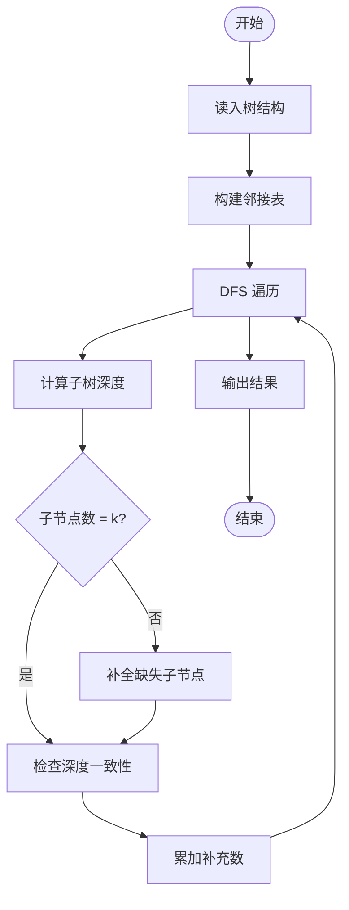
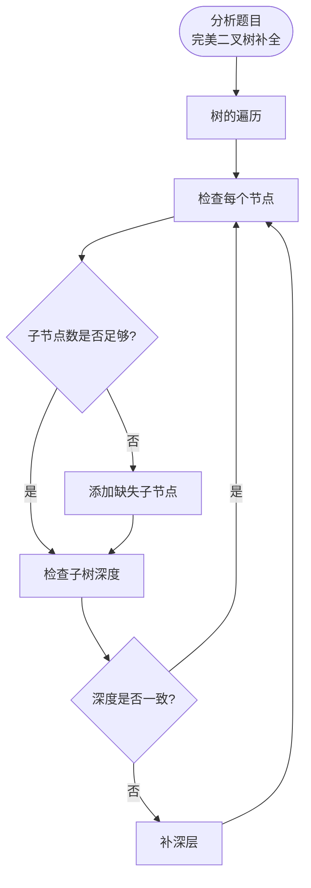

# L3-035 - 完美树（30 分）

- **时间限制**: 400 ms
- **内存限制**: 262144 KB
- **代码长度限制**: 16 KB

---

## 题目描述

给定一棵有 $N$ 个结点的树（树中结点从 $1$ 到 $N$ 编号，根结点编号为 $1$）。每个结点有一种颜色，或为黑，或为白。

称以结点 $u$ 为根的子树是 **好的**，若子树中黑色结点与白色结点的数量之差的绝对值不超过 $1$。称整棵树是 **完美树**，若对于所有 $1 \le i \le N$，以结点 $i$ 为根的子树都是好的。

你需要将整棵树变成完美树，为此你可以进行以下操作任意次（包括零次）：选择任意一个结点 $i$  ($1 \le i \le N$)，改变结点 $i$ 的颜色（若结点 $i$ 目前是黑色则将其改为白色，若结点 $i$ 目前是白色则将其改为黑色）。这次操作的代价为 $P_i$。

求将给定的树变为完美树的最小代价。

注：以结点 $i$ 为根的子树，由结点 $i$ 以及结点 $i$ 的所有后代结点组成。

### 输入格式:

输入第一行为一个数 $N$ ($1 \le N \le 10^5$)，表示树的结点个数。

接下来的 $N$ 行，第 $i$ 行的前三个数为 $C_i, P_i, K_i$ ($1 \le P_i \le 10^4, 0 \le K_i \le N$)，分别表示树上编号为 $i$ 的结点的初始颜色（$0$ 为白色，$1$ 为黑色）、变换颜色的代价及孩子结点的数量。紧跟着有 $K_i$ 个数，为孩子结点的编号。数字均用一个空格隔开，所有的编号保证在 $1$ 到 $N$ 里，且不会有环。

数据中只包含一棵树。

### 输出格式:

输出一行一个数，表示将树 $T$ 变为完美树的最小代价。

### 输入样例:

```in
10
1 100 3 2 3 4
0 20 1 7
0 5 2 5 6
0 8 1 10
0 7 0
0 2 0
1 1 2 8 9
0 15 0
0 13 0
1 8 0

```

### 输出样例:

```out
15
```

## 提示:

样例中最佳的方案是：将 9 号点和 6 号点从白色变为黑色，此时代价为 13 + 2 = 15。

## 示例

### 示例 1

**输入:**
```
10
1 100 3 2 3 4
0 20 1 7
0 5 2 5 6
0 8 1 10
0 7 0
0 2 0
1 1 2 8 9
0 15 0
0 13 0
1 8 0

```

**输出:**
```
15
```

---

## 题目详解

### 一、解题思路

本题的 R 实现采用以下方法：把原问题拆成规模更小的子问题，用状态转移保存已计算结果，避免重复计算。

### 二、代码流程说明

1. 读取并解析标准输入，转换为题目所需的数据结构。
2. 按题意执行核心算法，维护中间状态并处理边界情况。
3. 整理计算结果，按照输出格式生成答案。

### 三、代码实现

```r
# 实现原理：把原问题拆成规模更小的子问题，用状态转移保存已计算结果，避免重复计算。
# 处理流程：读取输入 -> 建立状态 -> 执行算法 -> 按题目格式输出。
# 关键变量和循环均直接对应题目中的数据、约束或操作。

# 读取并解析标准输入。
v <- scan("stdin", what = numeric(), quiet = TRUE)
if (length(v) > 0L) {
    p <- 1L
    n <- as.integer(v[p])
    p <- p + 1L
    color <- integer(n)
    cost <- numeric(n)
    child <- vector("list", n)
# 按题目约束遍历当前数据，更新中间状态。
    for (i in seq_len(n)) {
        color[i] <- v[p]
        cost[i] <- v[p + 1L]
        k <- as.integer(v[p + 2L])
        p <- p + 3L
        child[[i]] <- if (k > 0L)
            as.integer(v[seq.int(p, p + k - 1L)])
        else integer()
        p <- p + k
    }
    order <- 1L
    h <- 1L
    while (h <= length(order)) {
        u <- order[h]
        h <- h + 1L
        order <- c(order, child[[u]])
    }
# 执行核心排序、状态转移或选择逻辑。
    dp <- vector("list", n)
    for (u in rev(order)) {
        sums <- c(`0` = 0)
        for (w in child[[u]]) {
            nexts <- numeric()
            for (a in names(sums)) for (b in names(dp[[w]])) {
                z <- as.character(as.integer(a) + as.integer(b))
                nexts[z] <- min(if (is.na(nexts[z])) Inf else nexts[z],
                  sums[[a]] + dp[[w]][[b]])
            }
            sums <- nexts
        }
        ans <- c(`-1` = Inf, `0` = Inf, `1` = Inf)
        for (dif in c(-1L, 0L, 1L)) for (own in c(-1L, 1L)) {
            req <- dif - own
            if (as.character(req) %in% names(sums)) {
                z <- sums[[as.character(req)]] + if (color[u] ==
                  (own == 1L))
                  0
                else cost[u]
                ans[as.character(dif)] <- min(ans[as.character(dif)],
                  z)
            }
        }
        dp[[u]] <- ans
    }
# 严格按照题目规定的输出格式输出答案。
    cat(min(dp[[1]]), "\n", sep = "")
}
```

### 四、代码流程图



### 五、解题流程图



### 六、常见易错点

- 题目描述、输入格式、输出格式和输入输出样例必须保持原文不变。
- R 语言下标从 1 开始，注意编号转换和空输入边界。
- 输出时严格保留题目规定的空格、换行和小数位数。
