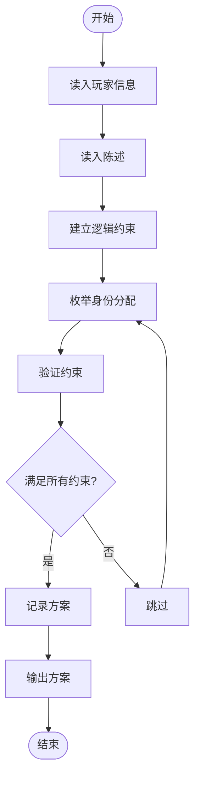
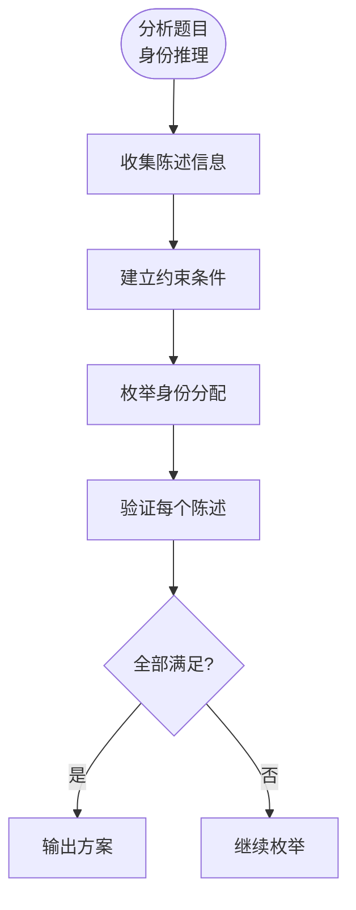

# L3-036 - 血染钟楼（30 分）

- **时间限制**: 6000 ms
- **内存限制**: 65536 KB
- **代码长度限制**: 16 KB

---

## 题目描述

九条可怜最近非常沉迷血染钟楼 —— 一款类狼人杀的身份推理类的游戏。在一局血染钟楼的游戏中，玩家们之间隐藏着一名"恶魔"，而所有善良玩家的目标就是将抽到恶魔身份的玩家绳之以法。

今天，九条可怜和她的小伙伴们开了一局 $n+1$ 名玩家参与的游戏，可怜的编号是 $0$，其他玩家编号从 $1$ 到 $n$。
可怜抽到的身份是占卜师，其技能如下（注意这儿和标准钟楼规则有出入）：

1. 每个夜晚，你可以选择任意名玩家，并得知被选择的玩家中是否有恶魔。
2. 有一名除你以外善良玩家始终被你的能力视为恶魔。

换句话说，在剩下的 $n$ 名玩家中，存在着两名未知的玩家，如果这两名玩家均未被可怜选中，可怜就会得到信息 0，否则就会得到信息 1。
在抽到身份的时候，可怜就对游戏开始的前 $m$ 个夜晚进行了规划：她打算在第 $i$ 个夜晚选中编号在区间 $[l_i, r_i]$ 内的所有玩家。
因为血染钟楼的第一个夜晚通常比较漫长，所以可怜在百无聊赖之际开始了头脑风暴。如果一切顺利，在 $m$ 晚之后，她将能得到 $m$ 个 0 或 1 的信息，共有 $2^m$ 种不同的可能性。可怜想要知道在这些可能性中，有多少种结果是可能发生的且可以让她**唯一**确定被她技能识别的两名玩家。

### 输入格式:

第一行输入一个整数 $t (1 \leq t \leq 10^3)$，表示数据组数。
第二行输入两个整数 $n, m(1 \leq n,m \leq 10^5)$，表示可怜以外的玩家数量以及可怜规划的夜晚数量。
接下来 $m$ 行每行两个整数 $l_i, r_i (1 \leq l_i \leq r_i \leq n)$，表示可怜的计划中在第 $i$ 晚会被选中的玩家编号区间。
输入保证所有数据中满足 $n > 10^3$ 或 $m > 10^3$ 的数据不超过 $5$ 组。

### 输出格式:

对于每组数据，输出一行一个整数，表示满足条件的可能性数量。答案可能很大，你只需要输出对 $998244353$ 取模后的结果。
### 输入样例:

```in
3
4 1
2 3
5 4
2 5
1 3
5 5
2 4
10 10
1 2
6 6
3 7
3 6
1 8
9 10
1 6
4 4
8 8
5 8
```

### 输出样例:

```out
1
2
7
```

### 样例解释

在第一组数据中，可怜得到的信息共有两种可能性：

1. 得到的信息为 0，表明两名目标的玩家均不在区间 $[2,3]$ 中，因此可以唯一确定他们的编号为 $(1, 4)$。
2. 得到的信息为 1，表明至少有一名目标的玩家在区间 $[2, 3]$ 中，此时共有四种可能性 $(1,2), (1,3),(2,4), (3,4)$，因此不能唯一确定。
在第二组数据中，满足要求的两种可能性如下所示：
1. 四天得到的信息依次为 1110，此时目标玩家的编号一定为 $(1,5)$。
2. 四天得到的信息依次为 1011，此时目标玩家的编号一定为 $(4,5)$。
容易验证其他 $14$ 种可能性均不满足条件。

## 示例

### 示例 1

**输入:**
```
3
4 1
2 3
5 4
2 5
1 3
5 5
2 4
10 10
1 2
6 6
3 7
3 6
1 8
9 10
1 6
4 4
8 8
5 8
```

**输出:**
```
1
2
7
```

---

## 题目详解

### 一、解题思路

本题的 R 实现采用以下方法：将输入组织为矩阵或表格，按题目定义的行、列和状态关系完成计算。

### 二、代码流程说明

1. 读取并解析标准输入，转换为题目所需的数据结构。
2. 按题意执行核心算法，维护中间状态并处理边界情况。
3. 整理计算结果，按照输出格式生成答案。

### 三、代码实现

```r
# 实现原理：将输入组织为矩阵或表格，按题目定义的行、列和状态关系完成计算。
# 处理流程：读取输入 -> 建立状态 -> 执行算法 -> 按题目格式输出。
# 关键变量和循环均直接对应题目中的数据、约束或操作。

# 读取并解析标准输入。
v <- scan("stdin", what = integer(), quiet = TRUE)
if (length(v) > 0L) {
    p <- 1L
    t <- v[p]
    p <- p + 1L
    out <- numeric(t)
# 按题目约束遍历当前数据，更新中间状态。
    for (case in seq_len(t)) {
        n <- v[p]
        m <- v[p + 1L]
        p <- p + 2L
        cover <- matrix(FALSE, nrow = n, ncol = m)
        for (i in seq_len(m)) {
            l <- v[p]
            r <- v[p + 1L]
            p <- p + 2L
            cover[l:r, i] <- TRUE
        }
        seen <- new.env(hash = TRUE, parent = emptyenv())
        for (x in 1:(n - 1L)) for (y in (x + 1L):n) {
            key <- paste(which(cover[x, ] | cover[y, ]), collapse = ",")
            if (key == "")
                key <- "empty"
            old <- if (exists(key, envir = seen, inherits = FALSE))
                get(key, envir = seen, inherits = FALSE)
            else 0L
            assign(key, old + 1L, envir = seen)
        }
        vals <- unlist(as.list(seen))
        out[case] <- sum(vals == 1L)%%998244353
    }
# 严格按照题目规定的输出格式输出答案。
    cat(paste(out, collapse = "\n"), "\n", sep = "")
}
```

### 四、代码流程图



### 五、解题流程图



### 六、常见易错点

- 题目描述、输入格式、输出格式和输入输出样例必须保持原文不变。
- R 语言下标从 1 开始，注意编号转换和空输入边界。
- 输出时严格保留题目规定的空格、换行和小数位数。
