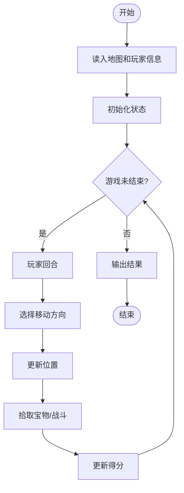
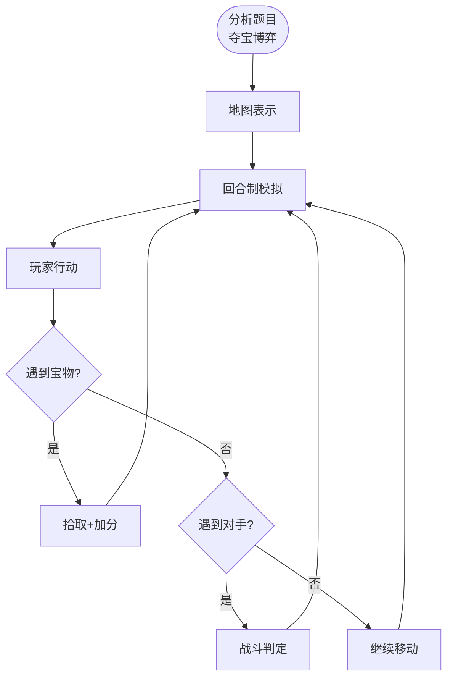

# L3-037 - 夺宝大赛（30 分）

- **时间限制**: 400 ms
- **内存限制**: 65536 KB
- **代码长度限制**: 16 KB

---

## 题目描述

夺宝大赛的地图是一个由 $n\times m$ 个方格子组成的长方形，主办方在地图上标明了所有障碍、以及大本营宝藏的位置。参赛的队伍一开始被随机投放在地图的各个方格里，同时开始向大本营进发。所有参赛队从一个方格移动到另一个无障碍的相邻方格（“相邻”是指两个方格有一条公共边）所花的时间都是 1 个单位时间。但当有多支队伍同时进入大本营时，必将发生火拼，造成参与火拼的所有队伍无法继续比赛。大赛规定：最先到达大本营并能活着夺宝的队伍获得胜利。
假设所有队伍都将以最快速度冲向大本营，请你判断哪个队伍将获得最后的胜利。

### 输入格式:

输入首先在第一行给出两个正整数 $m$ 和 $n$（$2< m,n\le 100$），随后 $m$ 行，每行给出 $n$ 个数字，表示地图上对应方格的状态：$1$ 表示方格可通过；$0$ 表示该方格有障碍物，不可通行；$2$ 表示该方格是大本营。题目保证只有 1 个大本营。
接下来是参赛队伍信息。首先在一行中给出正整数 $k$（$0<k<m\times n/2$），随后 $k$ 行，第 $i$（$1\le i \le k$）行给出编号为 $i$ 的参赛队的初始落脚点的坐标，格式为 `x y`。这里规定地图左上角坐标为 `1 1`，右下角坐标为 `n m`，其中 `n` 为列数，`m` 为行数。注意参赛队只能在地图范围内移动，不得走出地图。题目保证没有参赛队一开始就落在有障碍的方格里。
### 输出格式:

在一行中输出获胜的队伍编号和其到达大本营所用的单位时间数量，数字间以 1 个空格分隔，行首尾不得有多余空格。若没有队伍能获胜，则在一行中输出 `No winner.`
### 输入样例 1:

```in
5 7
1 1 1 1 1 0 1
1 1 1 1 1 0 0
1 1 0 2 1 1 1
1 1 0 0 1 1 1
1 1 1 1 1 1 1
7
1 5
7 1
1 1
5 5
3 1
3 5
1 4
```
### 输出样例 1:

```out
7 6
```
## 样例 1 说明：

七支队伍到达大本营的时间顺次为：7、不可能、5、3、3、5、6，其中队伍 4 和 5 火拼了，队伍 3 和 6 火拼了，队伍 7 比队伍 1 早到，所以获胜。
### 输入样例 2:

```in
5 7
1 1 1 1 1 0 1
1 1 1 1 1 0 0
1 1 0 2 1 1 1
1 1 0 0 1 1 1
1 1 1 1 1 1 1
7
7 5
1 3
7 1
1 1
5 5
3 1
3 5
```
### 输出样例 2:

```out
No winner.
```

## 示例

### 示例 1

**输入:**
```
5 7
1 1 1 1 1 0 1
1 1 1 1 1 0 0
1 1 0 2 1 1 1
1 1 0 0 1 1 1
1 1 1 1 1 1 1
7
1 5
7 1
1 1
5 5
3 1
3 5
1 4
```

**输出:**
```
7 6
```

### 示例 2

**输入:**
```
5 7
1 1 1 1 1 0 1
1 1 1 1 1 0 0
1 1 0 2 1 1 1
1 1 0 0 1 1 1
1 1 1 1 1 1 1
7
7 5
1 3
7 1
1 1
5 5
3 1
3 5
```

**输出:**
```
No winner.
```

---

## 题目详解

### 一、解题思路

本题的 R 实现采用以下方法：将输入组织为矩阵或表格，按题目定义的行、列和状态关系完成计算。

### 二、代码流程说明

1. 读取并解析标准输入，转换为题目所需的数据结构。
2. 按题意执行核心算法，维护中间状态并处理边界情况。
3. 整理计算结果，按照输出格式生成答案。

### 三、代码实现

```r
# 实现原理：将输入组织为矩阵或表格，按题目定义的行、列和状态关系完成计算。
# 处理流程：读取输入 -> 建立状态 -> 执行算法 -> 按题目格式输出。
# 关键变量和循环均直接对应题目中的数据、约束或操作。

# 读取并解析标准输入。
v <- scan("stdin", what = numeric(), quiet = TRUE)
if (length(v) > 0L) {
    p <- 1L
    nr <- as.integer(v[p])
    nc <- as.integer(v[p + 1L])
    p <- p + 2L
    g <- matrix(v[seq.int(p, p + nr * nc - 1L)], nrow = nr, ncol = nc,
        byrow = TRUE)
    p <- p + nr * nc
    tar <- which(g == 2, arr.ind = TRUE)[1, ]
    d <- matrix(-1L, nr, nc)
    d[tar[1], tar[2]] <- 0L
    queue <- matrix(tar, nrow = 1L)
    head <- 1L
# 按题目约束遍历当前数据，更新中间状态。
    while (head <= nrow(queue)) {
        u <- queue[head, ]
        head <- head + 1L
        for (z in list(c(1, 0), c(-1, 0), c(0, 1), c(0, -1))) {
            a <- u[1] + z[1]
            b <- u[2] + z[2]
            if (a >= 1L && a <= nr && b >= 1L && b <= nc && g[a,
                b] != 0 && d[a, b] < 0L) {
                d[a, b] <- d[u[1], u[2]] + 1L
                queue <- rbind(queue, c(a, b))
            }
        }
    }
    k <- as.integer(v[p])
    p <- p + 1L
    result <- matrix(numeric(), nrow = 0L, ncol = 2L)
    for (i in seq_len(k)) {
        xx <- as.integer(v[p])
        yy <- as.integer(v[p + 1L])
        p <- p + 2L
        z <- d[yy, xx]
        if (z >= 0)
            result <- rbind(result, c(z, i))
    }
    if (!nrow(result))
# 严格按照题目规定的输出格式输出答案。
        cat("No winner.\n")
    else {
# 执行核心排序、状态转移或选择逻辑。
        result <- result[order(result[, 1], result[, 2]), , drop = FALSE]
        printed <- FALSE
        for (j in seq_len(nrow(result))) {
            if (sum(result[, 1] == result[j, 1]) == 1L) {
                cat(paste(result[j, 2], result[j, 1]), "\n", sep = "")
                printed <- TRUE
                break
            }
        }
        if (!printed)
            cat("No winner.\n")
    }
}
```

### 四、代码流程图



### 五、解题流程图



### 六、常见易错点

- 题目描述、输入格式、输出格式和输入输出样例必须保持原文不变。
- R 语言下标从 1 开始，注意编号转换和空输入边界。
- 输出时严格保留题目规定的空格、换行和小数位数。
