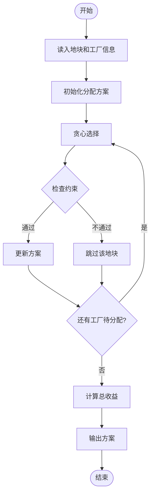
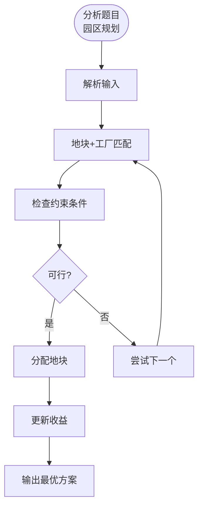

# L3-038 - 工业园区建设（30 分）

- **时间限制**: 800 ms
- **内存限制**: 65536 KB
- **代码长度限制**: 16 KB

---

## 题目描述

某工业园区要进行建设，共有 $N$ 块工业用地排成一条直线，其中上面已经有若干块用地建设起了工厂，其他地方为空地。

现在工业园区计划在空地上建设至多 $M$ 个新工厂以及一个仓库，希望在完成计划后，仓库离最近的 $k$ 个工厂的距离之和尽可能小。

两块用地的距离等于他们的编号的差；即 1 号用地与 2 号用地的距离为 1。一个空地上只能建设一个工厂，仓库可以跟工厂建在一起。

### 输入格式:

数据的第一行是一个正整数 $T$，表示数据的组数。

每组数据的输入第一行为三个整数 $N, M, k$ ($1 \le N \le 2\times10^5, 0 \le M \le N, 1 \le k \le N$)，表示有 $N$ 块用地，最多可以新建 $M$ 个新工厂，仓库离最近的 $k$ 个工厂距离之和需要尽可能小。

接下来的一行是一个只由 $0,1$ 组成的长度为 $N$ 的字符串 $S$，第 $i$ 个字符 $S_i$ 为 $0$ 表示第 $i$ 块地块为空地，$1$ 表示第 $i$ 块地块上已建工厂。地块编号从 1 开始。 

数据约定：

设 $F_S$ 为 $S$ 对应的已建工厂的地块数量，则有 $k \le M + F_S \le N$。给定的数据有 $\sum{N}\le5\times10^5$。

### 输出格式:

输出 $N$ 个整数，表示仓库建在第 $i$ 块用地时，离最近的 $k$ 个工厂的最小的距离之和是多少。

### 输入样例:

```in
3
5 1 3
10110
10 3 5
1001001010
2 1 2
10

```

### 输出样例:

```out
3 2 2 2 3
10 7 6 7 6 6 6 6 7 10
1 1
```

## 示例

### 示例 1

**输入:**
```
3
5 1 3
10110
10 3 5
1001001010
2 1 2
10

```

**输出:**
```
3 2 2 2 3
10 7 6 7 6 6 6 6 7 10
1 1
```

---

## 题目详解

### 一、解题思路

本题的 R 实现采用以下方法：先解析数据并按题目规定的关键字排序，再进行顺序处理和格式化输出。

### 二、代码流程说明

1. 读取并解析标准输入，转换为题目所需的数据结构。
2. 按题意执行核心算法，维护中间状态并处理边界情况。
3. 整理计算结果，按照输出格式生成答案。

### 三、代码实现

```r
# 实现原理：先解析数据并按题目规定的关键字排序，再进行顺序处理和格式化输出。
# 处理流程：读取输入 -> 建立状态 -> 执行算法 -> 按题目格式输出。
# 关键变量和循环均直接对应题目中的数据、约束或操作。

# 读取并解析标准输入。
lines <- readLines("stdin", warn = FALSE)
if (length(lines) > 0L) {
    t <- as.integer(lines[1])
    out <- character(t)
    p <- 2L
# 按题目约束遍历当前数据，更新中间状态。
    for (case in seq_len(t)) {
        z <- as.integer(strsplit(trimws(lines[p]), " +")[[1]])
        p <- p + 1L
        n <- z[1]
        m <- z[2]
        k <- z[3]
        road <- strsplit(trimws(lines[p]), "", fixed = TRUE)[[1]]
        p <- p + 1L
        factories <- which(road == "1") - 1L
        empty <- which(road == "0") - 1L
        ans <- numeric(n)
        for (x in 0:(n - 1L)) {
# 执行核心排序、状态转移或选择逻辑。
            ds <- c(abs(factories - x), sort(abs(empty - x))[seq_len(min(m,
                length(empty)))])
            ans[x + 1L] <- sum(sort(ds)[seq_len(k)])
        }
        out[case] <- paste(ans, collapse = " ")
    }
# 严格按照题目规定的输出格式输出答案。
    cat(paste(out, collapse = "\n"), "\n", sep = "")
}
```

### 四、代码流程图



### 五、解题流程图



### 六、常见易错点

- 题目描述、输入格式、输出格式和输入输出样例必须保持原文不变。
- R 语言下标从 1 开始，注意编号转换和空输入边界。
- 输出时严格保留题目规定的空格、换行和小数位数。
