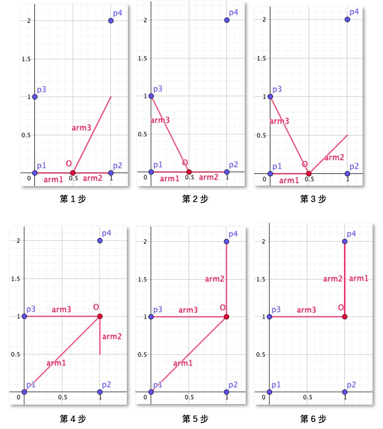
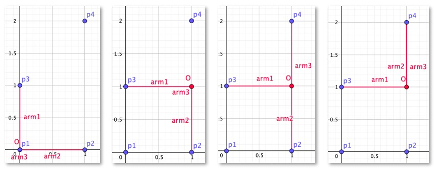
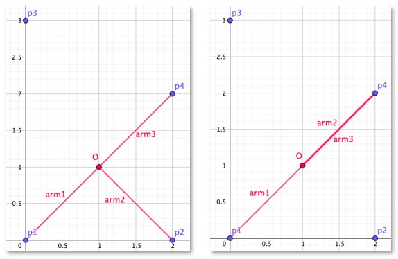
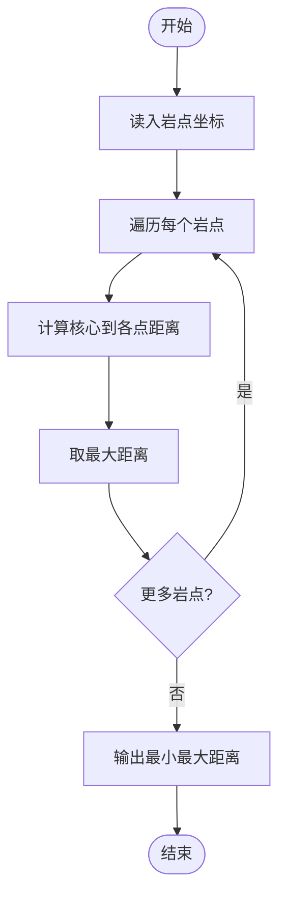
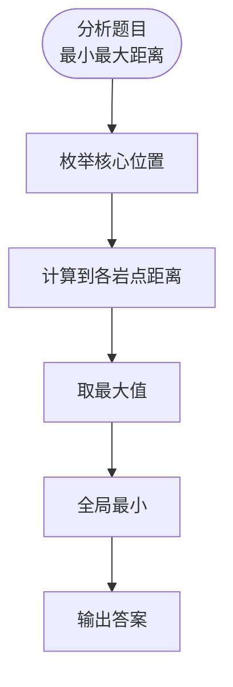

# L3-039 - 攀岩（30 分）

- **时间限制**: 4000 ms
- **内存限制**: 524288 KB
- **代码长度限制**: 16 KB

---

## 题目描述

九条可怜最近接触到了攀岩这项运动。作为一名运动量接近为零的家里蹲，相比于动手攀岩，可怜显然更加享受攀岩运动中动脑的部分，即对攀岩路线的规划。
为了只动脑，可怜设计了一个简易的攀岩机器人来帮她动手。这个机器人由一个核心（大小可以忽略不计）和三个长度至多为 $r$ 的可伸缩机械臂组成，如下图所示：


一面攀岩墙可以看成一个二维的无穷平面，上面有 $n$ 个不同位置的岩点 $p_1, \dots, p_n$。在攀岩开始时，机器人的两个机械臂需要分别抓住岩点 $p_1$ 和 $p_2$，而其核心和第三个机械臂可以在任意位置。攀岩的目标是让机器人有两支机械臂同时抓握住岩点 $p_n$。
在攀岩过程中，机器人需要保证**每时每刻**都有两支机械臂抓握住两个**不同**的岩点。在满足这点的情况下，机器人可以在机械臂长度允许的情况下进行如下移动：
1. 连续地将核心的位置从当前位置移动到任意位置。
2. 用第三条机械臂抓握住一个岩点（可以与某条其他机械臂抓住相同的岩点）。
3. 让一条机械臂松开其抓握的岩点。注意，只有当另外两条机械臂已经抓握住不同岩点时，才能进行这项操作。
**注：**我们假设岩点的大小是无穷小，不会影响机器人的移动，比如机械臂、核心轨迹都可以经过岩点。
下面是一个攀岩过程的例子，假设平面上有四个岩点，坐标分别是 $(0,0), (1,0),(0,1), (1,2)$，则下面展示了一个 $r=\sqrt 2$ 时，即机械臂长度至多为 $\sqrt 2$ 时的攀岩方案。



1. 初始时，可怜将机器人的核心放在 $(0.5, 0)$ 处，第三根手臂随意地放在 $(1,1)$ 处。
2. 机器人的第三机械臂抓握住岩点 $p_3$。
3. 机器人的第二机械臂松开，并移动到 $(1, 0.5)$ 处。
4. 机器人的核心移动至 $(1,1)$，此时第一机械臂的长度到达极限 $\sqrt 2$。
5. 机器人的第二机械臂抓握住岩点 $p_4$。
6. 机器人的第一机械臂松开，并抓握住岩点 $p_4$，完成攀岩目标。

显然，机器人的机械臂长度越短，对可怜的路径规划能力要求越高。但是这个机械臂的长度也不能太短，不然机器人可能无论如何都无法完成攀岩任务。比如在上述任务中，如果机械臂长度小于 $0.5$，那么机器人将无法同时抓握 $p_1$ 和 $p_2$，这意味着它连开始攀岩都无法做到，更别说完成攀岩任务了。
因此，为了在合理范围内尽可能地挑战自己的大脑，可怜希望你对于攀岩馆中的每一项攀岩任务，都帮她计算（在可能完成攀岩任务的前提下）机械臂的最短长度是多少。

### 输入格式:

第一行输入一个整数 $t$ $(t \leq 100)$，表示攀岩馆内攀岩任务的数量。
每个任务的第一行都是一个整数 $n$ $(3 \leq n \leq 1500)$，表示攀岩任务涉及的岩点数量。
接下来 $n$ 行，每行两个整数 $(x_i, y_i)$，表示第 $i$ 个岩点的坐标。输入保证 $0 \leq x_i, y_i \leq 10^6$ 且同一个攀岩任务中的岩点坐标两两不同。
输入保证满足 $n > 100$ 的数据不超过 $3$ 组。

### 输出格式:

对于每个攀岩任务输出一行一个浮点数，表示最短可能的机械臂长度。你的答案在绝对误差或者相对误差不超过 $10^{-6}$ 的情况下都会被视为正确。

### 输入样例:

```in
4
4
0 0
1 0
0 1
1 2
4
0 0
2 0
0 3
2 2
7
0 0
1 0
2 0
2 1
2 2
1 2
0 2
15
13 2
13 3
12 44
6 17
4 71
14 58
4 49
2 51
8 37
1 18
5 43
5 35
1 84
10 23
13 69
```

### 输出样例:

```out
0.99999999498
1.41421355524
1.00000000498
10.13227667717

```

## 示例

### 示例 1

**输入:**
```
4
4
0 0
1 0
0 1
1 2
4
0 0
2 0
0 3
2 2
7
0 0
1 0
2 0
2 1
2 2
1 2
0 2
15
13 2
13 3
12 44
6 17
4 71
14 58
4 49
2 51
8 37
1 18
5 43
5 35
1 84
10 23
13 69
```

**输出:**
```
0.99999999498
1.41421355524
1.00000000498
10.13227667717

```

## 样例解释

第一组数据和题面中的攀岩任务一致，其最小机械臂长度为 1，而样例输出的答案在 $10^{-6}$ 的误差范围内，故会被视为正确。
下面给出了一个机械臂长度为 1 时的攀岩方案。攀岩开始时，机器人的核心与岩点 $p_1$ 重叠，第三机械臂在长度为 $0$ 的情况下抓住了这个岩点，且第一机械臂额外抓住了岩点 $p_3$。接着，第三机械臂松开岩点 $p_1$，并随着核心移动至点 $(1,1)$。然后，第三机械臂伸出并抓握住岩点 $p_4$。最后，第二机械臂松开岩点 $p_2$ 并同样抓握住岩点 $p_4$，完成攀岩任务。



第二组数据中，最小机械臂长度为 $\sqrt 2$，下图展示了一个对应的攀岩方案。攀岩开始时，机器人的核心位于 $(1,1)$ 且三个机械臂分别抓握住岩点 $p_1, p_2$ 和 $p_4$。随后，第二机械臂松开点 $p_2$ 并抓握住岩点 $p_4$，完成攀岩任务。注意到此攀岩方案全程没有使用岩点 $p_3$，这也是被允许的：**攀岩任务中不要求使用所有的岩点**。



---

## 题目详解

### 一、解题思路

本题的 R 实现采用以下方法：二分圆半径；在每个候选半径下，以可共用圆覆盖的点对为状态，检查能否通过满足三角形外接圆约束的相邻状态到达终点。

### 二、代码流程说明

1. 读取并解析标准输入，转换为题目所需的数据结构。
2. 按题意执行核心算法，维护中间状态并处理边界情况。
3. 整理计算结果，按照输出格式生成答案。

### 三、代码实现

```r
# 实现原理：二分圆半径；在每个候选半径下，以可共用圆覆盖的点对为状态，检查能否通过满足三角形外接圆约束的相邻状态到达终点。
# 处理流程：读取输入 -> 建立状态 -> 执行算法 -> 按题目格式输出。
# 关键变量和循环均直接对应题目中的数据、约束或操作。

# 读取并解析标准输入。
v <- scan("stdin", what = numeric(), quiet = TRUE)
if (length(v) > 0L) {
    t <- as.integer(v[1])
    p <- 2L
    out <- numeric(t)
# 按题目约束遍历当前数据，更新中间状态。
    for (case in seq_len(t)) {
        n <- as.integer(v[p])
        p <- p + 1L
        pts <- matrix(v[seq(p, p + 2L * n - 1L)], ncol = 2L,
            byrow = TRUE)
        p <- p + 2L * n
        d2 <- matrix(0, n, n)
        for (i in seq_len(n)) for (j in i:n) {
            z <- sum((pts[i, ] - pts[j, ])^2)
            d2[i, j] <- d2[j, i] <- z
        }
        triple <- function(a, b, c, r) {
# 执行核心排序、状态转移或选择逻辑。
            z <- sort(c(a, b, c)^2, decreasing = TRUE)
            if (z[1] >= z[2] + z[3] - 1e-10)
                return(sqrt(z[1])/2 <= r + 1e-09)
            sp <- (a + b + c)/2
            ar2 <- sp * (sp - a) * (sp - b) * (sp - c)
            if (ar2 <= 0)
                return(TRUE)
            a * b * c/(4 * sqrt(ar2)) <= r + 1e-09
        }
        feasible <- function(r) {
            if (sqrt(d2[1, 2]) > 2 * r + 1e-09)
                return(FALSE)
            allowed <- d2 <= (2 * r + 1e-09)^2
            diag(allowed) <- FALSE
            nei <- lapply(seq_len(n), function(i) which(allowed[i,
                ]))
            vis <- matrix(FALSE, n, n)
            vis[1, 2] <- vis[2, 1] <- TRUE
            qa <- 1L
            qb <- 2L
            head <- 1L
            while (head <= length(qa)) {
                a <- qa[head]
                b <- qb[head]
                head <- head + 1L
                if (a == n || b == n)
                  return(TRUE)
                if (length(nei[[a]]) <= length(nei[[b]])) {
                  cand <- nei[[a]]
                  other <- b
                  first <- a
                }
                else {
                  cand <- nei[[b]]
                  other <- a
                  first <- b
                }
                for (z in cand) {
                  if (z == a || z == b || !allowed[other, z] ||
                    !triple(sqrt(d2[a, b]), sqrt(d2[first, z]),
                      sqrt(d2[other, z]), r))
                    next
                  if (!vis[a, z]) {
                    vis[a, z] <- vis[z, a] <- TRUE
                    qa <- c(qa, min(a, z))
                    qb <- c(qb, max(a, z))
                  }
                  if (!vis[b, z]) {
                    vis[b, z] <- vis[z, b] <- TRUE
                    qa <- c(qa, min(b, z))
                    qb <- c(qb, max(b, z))
                  }
                }
            }
            FALSE
        }
        lo <- 0
        hi <- sqrt(max(d2))
        for (it in seq_len(45L)) {
            mid <- (lo + hi)/2
            if (feasible(mid))
                hi <- mid
            else lo <- mid
        }
        out[case] <- hi
    }
# 严格按照题目规定的输出格式输出答案。
    cat(sprintf("%.11f\n", out), sep = "")
}
```

### 四、代码流程图



### 五、解题流程图



### 六、常见易错点

- 题目描述、输入格式、输出格式和输入输出样例必须保持原文不变。
- R 语言下标从 1 开始，注意编号转换和空输入边界。
- 输出时严格保留题目规定的空格、换行和小数位数。
